<p align="center">
  <picture>
    <source media="(prefers-color-scheme: dark)" srcset="assets/flowwyyy-wordmark-dark.svg">
    
  </picture>
</p>

<p align="center">
  <strong><code>flow</code>, with batteries.</strong>
</p>

<p align="center">
  
  
  
  
</p>

> **flowwyyy** is a task manager for **Claude Code and Codex** with a
> browser-based **Mission Control**, first-class **Slack** and **GitHub**
> triggers, a cross-source **Attention Router**, autonomous **owners**, and a
> working-memory layer that turns every session from a brilliant new hire into
> the engineer on your team.

<p align="center">
  
  <br><sub><em>flowwyyy in motion.</em></sub>
</p>

<p align="center">
  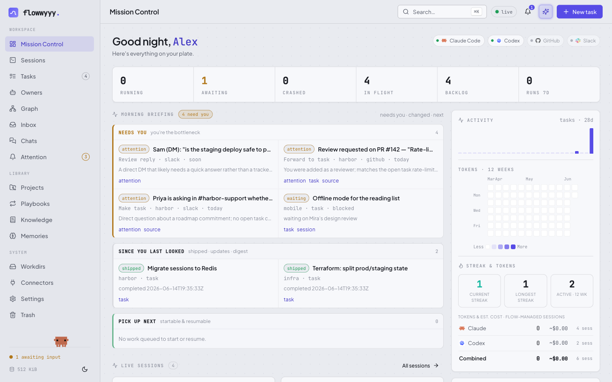
  <br><sub><em>Mission Control: your day at a glance — attention, in-flight work, agenda, and spend.</em></sub>
</p>

This README captures the current state. The surface grows often — what's
documented below is the floor, not the ceiling. The [changelog](CHANGELOG.md)
carries every release.

## flowwyyy = flow + batteries

flowwyyy is built on top of the original [`flow`](https://github.com/Facets-cloud/flow)
— a small, sharp CLI for managing personal tasks and bootstrapping per-task
agent sessions. flowwyyy keeps **everything `flow` already does** — it's
backward-compatible with upstream — and adds the layer flow never shipped: a
**browser UI (Mission Control)** plus the connectors, triage, and autonomy
features that make that UI worth leaving open all day.

**Two names, one tool:**

- **The CLI binary is `flow`.** You install `flow`, and every command in this
  README is `flow …` (`flow do`, `flow ui serve`, `flow done`). Scripts, hooks,
  and muscle memory from upstream flow keep working unchanged — nothing on the
  command line is renamed.
- **The UI / product is `flowwyyy`.** The browser app — Mission Control — wears
  the flowwyyy name. When someone says "flowwyyy," they mean the
  batteries-included whole: the `flow` CLI *plus* the UI *plus* the connectors.

If you already run upstream flow, flowwyyy is a drop-in superset. If you're new,
ignore the distinction: it's `flow` at the terminal and flowwyyy in the browser.

## Why flowwyyy

If you use Claude Code or Codex daily, you've felt the ceiling: every session is
a new hire. Brilliant, capable, ready to help — but with no memory of yesterday's
decisions, last week's migrations, or the half-finished threads in your other
tabs. You spend the first ten minutes of every session catching it up.

flowwyyy changes the relationship. It's a complete task manager — projects,
tasks, structured briefs, progress notes, playbooks for recurring work — *and* a
working-memory layer that injects all of it into every agent session
automatically. Capture once, work with the agent on it forever.

The first session feels normal. By session ten, the agent knows your codebase
quirks, your team, the customer you keep mentioning, and the migration you're
three steps into. By session fifty, it's the engineer on your team — not a new
hire you re-explain yourself to every morning.

Built for power users who want their agent to *work with them*, not just *help
them*.

## How context compounds

Every task feeds the same knowledge base. Every closed task makes the next one
smarter.

```
                                       ┌────────────────────────┐
                                       │   ~/.flow/kb/          │
                                       │   user · org · products│
                                       │   processes · business │
                                       └─────▲──────────▲───────┘
                                             │          │
                  flow do <task>             │ scoop    │ sweep
   ┌────────┐  ─────────────────▶  ┌─────────┴──────────┴─────┐
   │  Task  │                      │      agent session       │
   │  brief │  ◀──── updates ───── │  loads brief + kb +      │
   │ +notes │                      │  notes + repo conventions│
   └────────┘  ─── flow done ───▶  └──────────────────────────┘
                                       (auto-sweep transcript
                                        into kb on done)
```

- **Scoop (live):** during a session the flow skill listens for durable facts
  you mention — your role, a teammate's name, a product convention — and appends
  them to the matching kb file on the fly.
- **Distiller (mid-flight):** long-running sessions get periodic, silent
  KB checkpoints so durable facts are captured even before a task closes.
- **Sweep (on `flow done`):** when you close a task, flow spawns a headless pass
  that re-reads the entire transcript and pulls anything kb-worthy the live scoop
  missed, and writes a project update. The status flip is the contract; the sweep
  is best-effort.
- **Cross-reference:** `flow transcript <sibling-task>` and `flow search` let a
  current session read what was decided elsewhere.

Net effect: the longer you use flowwyyy, the more your knowledge base grows, the
less you re-explain yourself.

## How a task flows

1. **Capture.** Just talk. flow interviews you for what / why / where /
   done-when and writes a structured brief — no forms.
2. **Work.** `flow do <task>` opens a dedicated Claude or Codex session in its
   own tab (or attach it in the browser). The session already has the brief, the
   project context, and the knowledge base.
3. **Park.** Hit a blocker, set `waiting_on`, close the tab. Status holds.
4. **Resume.** A day later, `flow do <task>` resumes the *same* conversation
   with full memory of where it left off — a SessionStart hook re-injects the
   brief, updates, and repo conventions.
5. **Close.** `flow done` flips status, pushes the worktree branch, opens a PR,
   and runs the close-out sweep that distills the session into durable KB facts.

The fiftieth session is the point — not the first.

## Install

In any Claude Code session, paste this:

> Install flowwyyy from https://github.com/vishnukv-facets/flowwyyy

Claude reads the repo, gets the binary, and runs `flow init` — which installs the
flow skill into `~/.claude/skills/flow/SKILL.md` and registers a SessionStart
hook so every future session loads the skill automatically. Then say
**"let's get to work"** and follow along.

### Homebrew

```bash
brew install vishnukv-facets/flowwyyy/flowwyyy
flow init
```

Taps [`vishnukv-facets/homebrew-flowwyyy`](https://github.com/vishnukv-facets/homebrew-flowwyyy)
and installs the `flow` binary. Upgrade later with `brew upgrade flowwyyy`. (The
formula is named `flowwyyy` to avoid colliding with homebrew-core's `flow`; the
command it installs is still `flow`.)

<details>
<summary>Manual install (curl + tar + flow init)</summary>

```bash
# 1. Download + extract the binary for your Mac. (The binary is named `flow`.)
ARCH=arm64        # Apple Silicon (M1/M2/M3/M4) — use amd64 for Intel.

curl -fsSL \
  "https://github.com/vishnukv-facets/flowwyyy/releases/latest/download/flow-darwin-${ARCH}.tar.gz" \
  | tar -xz -C /usr/local/bin flow
chmod +x /usr/local/bin/flow
xattr -d com.apple.quarantine /usr/local/bin/flow 2>/dev/null || true

# 2. Initialize. This is required — it creates ~/.flow/, the SQLite
#    index, the knowledge base, AND installs the skill + SessionStart hook.
flow init
```

No prebuilt release yet? [Build from source](#building-from-source) — `make
install` produces the same `flow` binary and wires the skill + hook for you.

`flow init` is the step that wires flowwyyy into your agent. It:

- Creates `~/.flow/` (database, kb, projects, tasks, playbooks)
- Writes the flow skill to `~/.claude/skills/flow/SKILL.md`
- Adds a SessionStart hook to `~/.claude/settings.json` so every new session
  auto-loads the skill

The `xattr` step removes Gatekeeper's quarantine attribute so macOS doesn't
refuse to run the unsigned binary.

</details>

### Upgrade

In any Claude Code session:

> Upgrade flowwyyy from https://github.com/vishnukv-facets/flowwyyy

Claude fetches the latest binary and runs `flow skill update` to refresh the
skill and re-wire the SessionStart / UserPromptSubmit hooks. Check the running
version with `flow --version`.

## Quickstart

Open Claude (or Codex) and say **"let's get to work"**. The skill handles the
rest. Prefer the browser? `flow ui serve` and open `http://127.0.0.1:8787`.

## What you get

- **One task, one agent session, one tab.** `flow do <task>` spawns a dedicated
  tab in iTerm2, Warp, stock macOS Terminal, kitty (needs `allow_remote_control
  yes`), Ghostty, or your current zellij session — flow picks whichever you
  launched it from. Override with `FLOW_TERM=warp|iterm|terminal|zellij|kitty`.
  Tomorrow's `flow do <task>` resumes the same conversation.
- **Claude or Codex, your call.** Default is Claude. Pass `--agent codex` (or
  `--codex`) on `flow add task`, `flow do`, or `flow run playbook` to bootstrap a
  Codex session instead. Provider is per-task. The knowledge base, briefs, and
  close-out sweep work identically either way.
- **Per-task model selection.** Pin a model with `--model`, or let flow resolve
  one at launch from a default tier — upshifted for high-priority work,
  downshifted for richly-specified briefs. See [the session
  model](#the-session-model).
- **Provider handoff forks.** Mission Control can fork a task to the other
  provider when one is out of credits — copying the brief, updates, sidecar
  notes, and readable transcript, and recording lineage in both directions.
- **Worktrees by default.** `flow do` creates a per-task git worktree on branch
  `flow/<slug>`, so two parallel tasks on the same repo never collide.
  `flow do --here` binds the current session and never relocates.
- **Auto-PR on done.** `flow done` pushes the worktree branch and runs `gh pr
  create` against the detected base, with the brief as the PR body. Pass
  `--merge` (after approval) to merge; `--no-pr` to opt out.
- **Mission Control, in your browser.** `flow ui serve` boots a local web app
  with task / project / playbook views, inline editing, a Cmd+K palette, and a
  browser-attached terminal streaming Claude or Codex live. See
  [Mission Control](#mission-control--the-flowwyyy-ui).
- **Attention Router.** A cross-source triage queue that watches your connectors,
  scores what deserves a look, and surfaces cards you act on. See
  [Attention Router](#attention-router--cross-source-triage).
- **Owners & autonomous runs.** Durable, repo-scoped controllers that wake on a
  cadence to dispatch work, plus `flow do --auto` headless runs. See
  [Owners & autonomy](#owners--autonomous-runs).
- **Slack & GitHub triggers.** React to a Slack thread with `:claude:`/`:codex:`,
  or get assigned a PR/issue, and flow spins up a task bound to that source — same
  KB, same UI. See [Slack](#slack-integration--react-to-triage) and
  [GitHub](#github-integration--assigned-work-and-review-threads).
- **Full-text search.** `flow search "<query>"` over briefs, updates, KB, and
  agent memories via SQLite FTS5. Add `--in transcripts` or `--in all` to widen.
- **Copyable daily briefing.** `flow standup --for today` assembles Attention
  cards, waiting work, stale sessions, ready high-priority backlog, and recent
  activity into needs-action and FYI sections. Add `--clipboard`.
- **A knowledge base that grows.** Five markdown buckets for durable facts about
  you, your team, products, processes, and customers — live-appended during
  sessions, auto-swept from transcripts on `flow done`.
- **Soft delete, then restore.** `flow delete` hides without touching markdown;
  `flow restore` brings it back.
- **A skill that speaks plain English.** "What should I work on", "resume auth",
  "save a note" — the bundled skill turns intent into flow commands.

## The session model

`flow do <task>` resolves the task's provider (`claude` by default, `codex` when
created with `--agent codex`), pre-allocates or captures a session id, writes it
to the task row, and spawns a tab — running `claude --session-id <uuid>` (or the
equivalent `codex resume <uuid>`) with `FLOW_PROJECT` inlined. For Claude the
jsonl lands at the deterministic path
`~/.claude/projects/<encoded-cwd>/<uuid>.jsonl`; for Codex it's captured from
Codex's session store. Future `flow do` calls resume the same conversation. A
SessionStart hook re-injects the brief, updates, and repo context on every
resume.

### Worktrees, branches, and the close-out PR

By default `flow do` ensures a per-task git worktree at
`<repo>/.<agent>/worktrees/<slug>` on branch `flow/<slug>`, forked from
`origin/HEAD`. The session launches inside that worktree, so parallel tasks never
step on each other. `flow do --here` binds the current session and never
relocates.

`flow done` snapshots the worktree's diff against its starting HEAD, runs the
close-out sweep, then pushes the branch and runs `gh pr create --base <detected>
--head flow/<slug>` with the brief as the PR body. The PR URL is recorded against
the task. Pass `--merge` (only after the user approves shipping) to merge;
`--no-pr` to skip. Push/PR/merge failures warn and continue — the status flip is
the contract.

### Which model a session launches with

You don't pick a model during intake — it's resolved at launch:

1. **Explicit per-task model wins.** Set via `flow add task --model <m>` or
   `flow update task --model <m>` (backlog only); flow passes it through verbatim
   and stops.
2. **Otherwise flow picks a tier.** The baseline is a default tier
   (`FLOW_MODEL_TIER`, default **medium**) mapped per provider:

   | Tier | Claude | Codex |
   |------|--------|-------|
   | large | `opus` | `gpt-5.5` |
   | medium (default) | `sonnet` | `gpt-5.4` |
   | small | `haiku` | `gpt-5.4-mini` |

   High-priority work upshifts one rung; a **descriptive** brief (no deferred
   sections, ≥80 words, ≥2 "Done when" bullets) downshifts one rung when
   `FLOW_MODEL_AUTODOWNSHIFT` is on (the default).

The model is **locked once a session starts** (like the agent) — change it only
while the task is in backlog. `flow show task` surfaces the resolved model
(`[explicit]` or `[auto: <tier> tier]`).

### One-shot instructions with `--with`

`flow do <task> --with "<instruction>"` resumes (or starts) the session and
injects the instruction as the first user message, prefixed `[via flow do
--with]`. `--with-file <path>` injects `read instructions at <absolute path>`
instead (no size limit). This is the lane scheduled playbooks and owners use to
fire instructions at existing tasks without manual intervention.

### Focus instead of spawn

When `flow do <task>` runs for a task whose session is already live in another
tab, flow focuses that tab instead of spawning a duplicate.

### Agent hooks — what the UI knows about your sessions

The browser shows "agent idle / task in progress / waiting on you / needs
attention" because each running session emits lifecycle events through a
repo-local [agent-hooks](internal/agenthooks/) shim. `flow ui serve` installs
these into every known workdir automatically. Codex hooks are gated to
flow-owned terminals (`FLOW_HOOK_OWNED=1`) so ordinary Codex sessions in the same
repo never forward events into Mission Control.

## Mission Control — the flowwyyy UI

`flow ui serve` boots a local web app at `127.0.0.1:8787`. Same SQLite, same
markdown briefs, same skill — just the richer surface that gives flowwyyy its
name: side-by-side task lists, an Attention-aware briefing, inline brief editing,
live agent status, and a browser-attached terminal that streams the Claude or
Codex session over WebSocket. It reads and writes the same `~/.flow/flow.db`, so
the browser, your terminal sessions, and the bundled skill always see one
consistent view. Mission Control is a peer to the CLI, not a replacement.

<p align="center">
  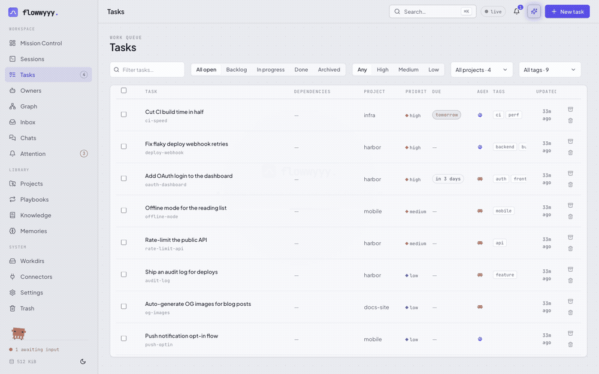
  <br><sub><em>Cmd+K — full-text search over briefs, updates, memories, tasks, and commands.</em></sub>
</p>

- **Cmd+K everything.** A global palette with FTS5 over briefs, updates,
  memories, tasks, and commands. Press Enter and you're on the task detail page
  or attached straight to its live terminal.
- **Task detail with inline editors.** Status, priority, due date, tags, provider
  (Claude/Codex), permission mode (default / auto / bypass), session id, brief,
  and append-only updates — segmented controls, one click to change.
- **Projects, playbooks, and a tasks table.** Every entity has a list and a
  detail page; the tasks table filters on status and priority.
- **Knowledge base browser.** The five markdown buckets rendered as a two-pane
  reader.
- **Browser-attached terminal.** Click *Open session* on any task and an
  xterm.js terminal streams the live agent — same scrollback, same input. Reload
  and the snapshot syncs back.
- **Same-session inbox monitor.** Every monitored source writes normalized events
  to the task's `inbox.jsonl`; when that task has a live flow-owned terminal, a
  task-local monitor wakes the *same* session with a short prompt instead of
  spawning a separate solver. Slack, GitHub, and future sources all use the same
  append-to-inbox contract.
- **Provider capability honesty.** Flow does not rely on host-native background
  runners. Claude Code's native background sessions are separate from Flow's monitor,
  and Codex currently exposes experimental app-server/remote-control building blocks
  that Flow does not depend on. Both providers are driven the same way: the
  task-local inbox monitor + Flow-owned terminal wake.

A tour of the rest of Mission Control:

<table>
<tr>
<td width="50%">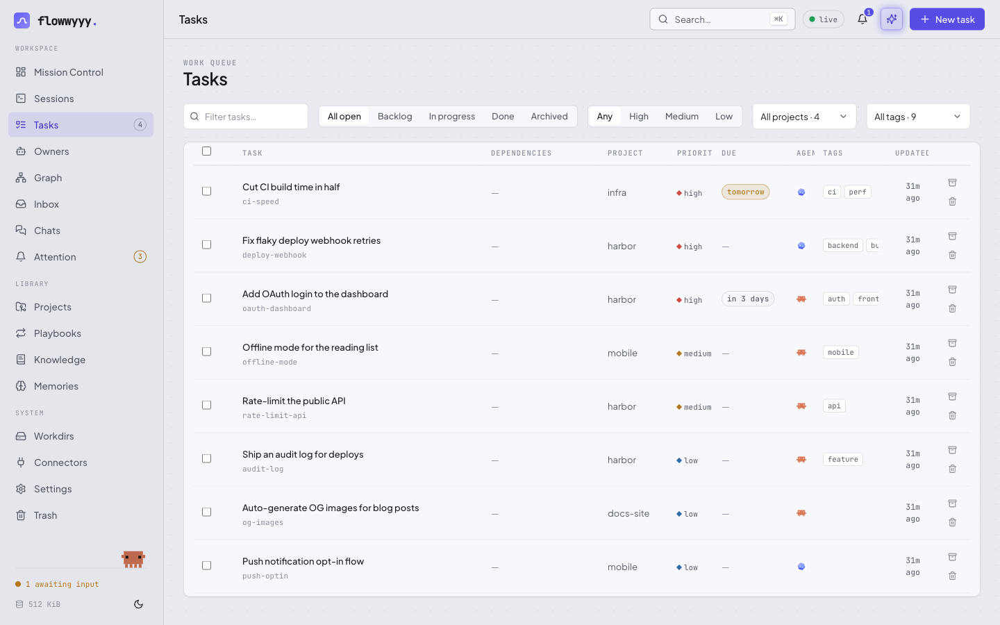<br><sub>Tasks — filter by status, priority, project, tag</sub></td>
<td width="50%">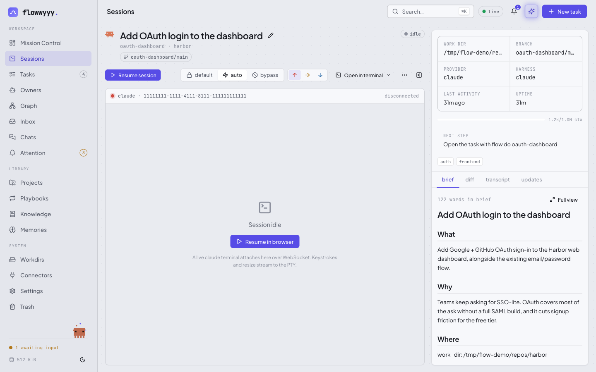<br><sub>Task detail — brief, branch, provider, live terminal</sub></td>
</tr>
<tr>
<td>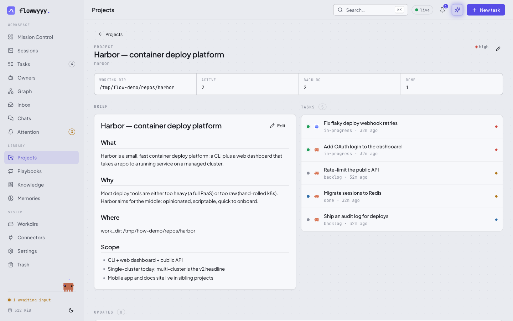<br><sub>Project detail — task breakdown + brief</sub></td>
<td>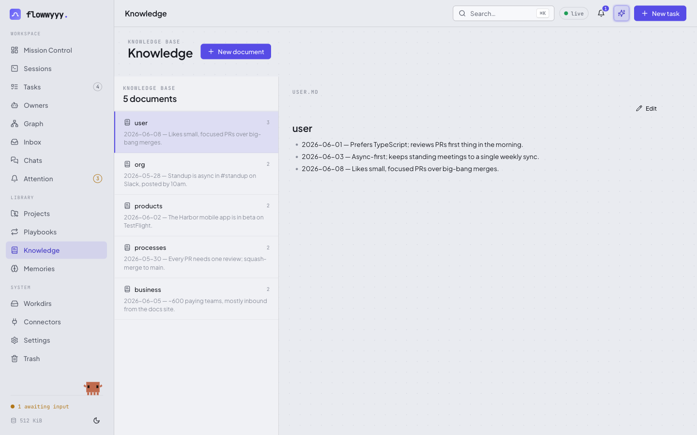<br><sub>Knowledge base — five markdown buckets</sub></td>
</tr>
<tr>
<td>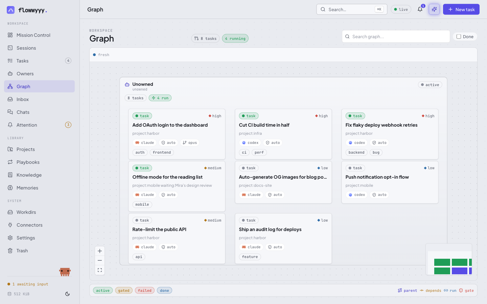<br><sub>Graph — task tree &amp; dependencies</sub></td>
<td>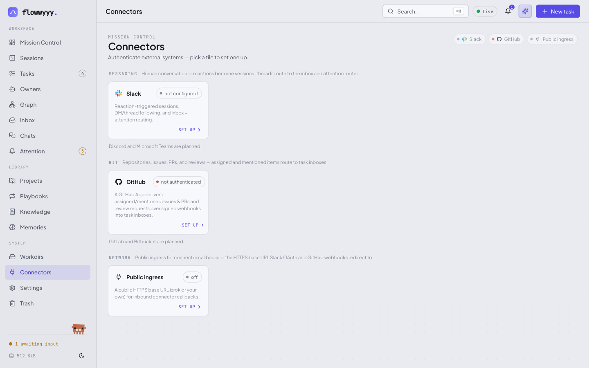<br><sub>Connectors — Slack, GitHub, public ingress</sub></td>
</tr>
<tr>
<td>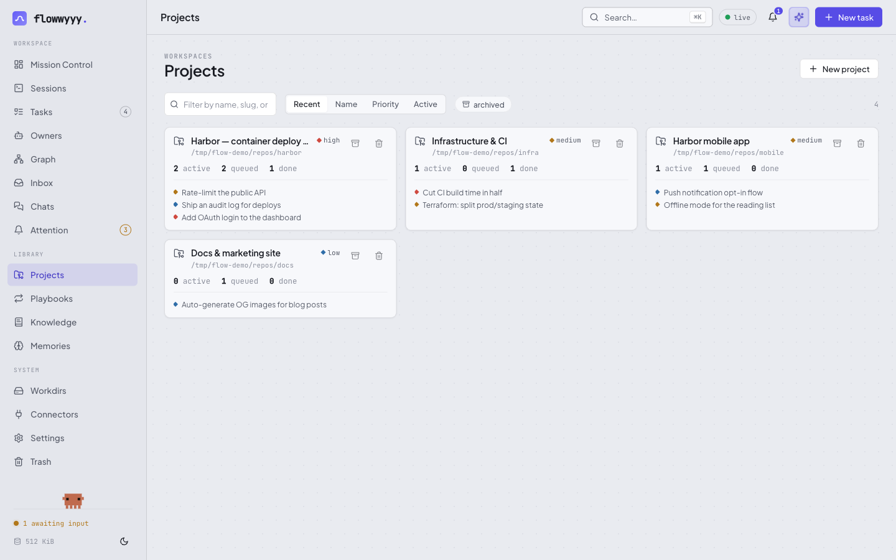<br><sub>Projects — every initiative, rolled up</sub></td>
<td>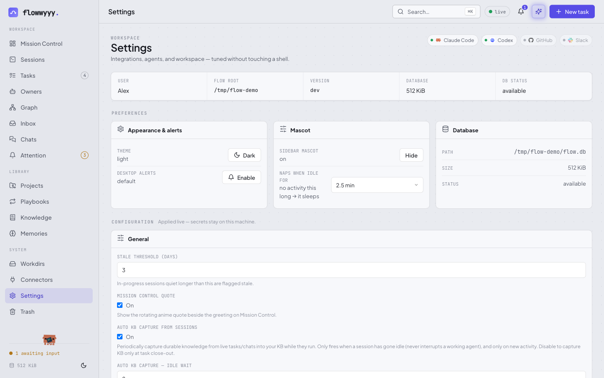<br><sub>Settings — tune everything without a shell</sub></td>
</tr>
</table>

**What it doesn't do:** no auth, no TLS, loopback only. Mission Control is a
*local* tool — the binary refuses to bind a non-loopback host without an explicit
`--host` flag. If you want it on a network, put your own auth in front.

`flow ui serve` also accepts `--host`, `--port`, `--bg` (run detached, logging to
`~/.flow/logs/ui-serve.log`), and `--no-quote`. The Go HTTP server is a single
binary — no Node runtime, no build step; the static UI ships inside the binary.

## Attention Router — cross-source triage

The Attention Router (the "steerer") is flowwyyy's cross-source triage surface.
It watches connector events (Slack, GitHub, and future sources), records a
steering trace for each, and writes promising items to an **attention feed** so
you decide what happens next. It's an operator-review queue — it surfaces, it
doesn't autonomously post, mute, or create work unless you opt in.

```
   connector event ─▶ Stage 0 involvement gate ─▶ Stage 1/2 classifier ─▶ attention_feed
                       (drop noise that doesn't       (Claude/Codex            (cards you
                        involve you)                   subprocess, budgeted)     review)
```

**Review it from the CLI:**

```bash
flow attention list --status new          # cards awaiting review
flow attention act <id> make-task         # turn a card into tracked work
flow attention act <id> forward           # route it to an existing matched task
flow attention act <id> confirm-handoff   # let the matched task's agent accept/decline
flow attention act <id> dismiss           # noise — hide this card (does not mute the source)
flow attention trace --since 24h          # audit the decision funnel
flow attention feedback --group source    # approval/dismiss rates by dimension
```

Mission Control adds retriage, mute-channel/sender/thread, open-source/session,
and send-reply on top.

<p align="center">
  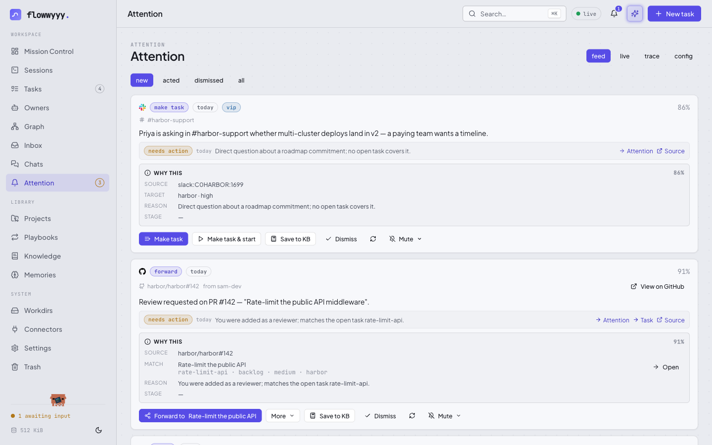
  <br><sub><em>The Attention feed — each card carries a source, a confidence score, a "why this," and one-click actions.</em></sub>
</p>

**Autonomy is surface-only by default.** Every outward action is disabled unless
you explicitly enable it. Only `make_task` and `forward` are auto-actable in
settings, and both require explicit enablement, confidence thresholds, and
traceable audit records. Substantive outbound replies are always manual: the
server never posts Slack replies directly — it opens an ephemeral, watchable
session that posts the *approved* text. Classifier work is budgeted
(`FLOW_STEERING_CLASSIFIER_BUDGET_PER_HOUR`, default `30`) and backs off on
quota/auth failures (`FLOW_STEERING_CLASSIFIER_FAILURE_COOLDOWN`, default `30m`).
Operator clicks authorize one action — never future autonomous behavior.

## Owners & autonomous runs

**Owners** are durable, repo-scoped controllers for ongoing outcomes. An owner
isn't one long session — it's an `owners/<slug>/charter.md`, a journal under
`owners/<slug>/updates/`, a row in the `owners` table, and short *ticks* that
wake, review state, dispatch work, self-pace, and exit.

<p align="center">
  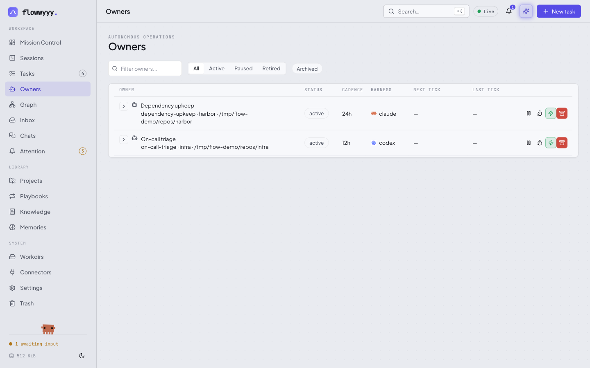
</p>

```bash
flow add owner "<name>" --work-dir <path> [--project <slug>] [--every 24h] [--agent claude|codex]
flow owner list                       # or: flow list owners
flow owner show <slug>
flow owner start|pause|retire <slug>
flow owner tick <slug>                # guided interactive tick; --auto for headless now
flow owner next <slug> --in <dur>     # set the next wake
```

Owners orchestrate; they don't do substantive work inline. A tick dispatches
tasks or playbook runs that can self-close, writes a journal note, sets its next
wake, and exits. The tick scheduler is an in-process heartbeat inside `flow ui
serve` (with boot/sleep catch-up); `flow owner tick-due` is the host-cron entry
point.

**Autonomous runs** — `flow do <task> --auto` runs a task end-to-end with no tab
and no human:

```bash
flow do <slug> --auto
flow do <slug> --auto --with "<one-off instruction>"
flow do <slug> --auto --with-file <path>
flow wait <slug> --until done          # block on completion
```

It returns immediately (printing the supervisor PID + log path). Claude runs
headlessly via `claude -p`; Codex via `codex exec`. Because no human is watching,
**match the model to the task** — pin `--model` (strong for hard work, small for
trivial) or set `--priority high` so the resolver upshifts. Run status lives in
`auto_run_status` ∈ {running, completed, dead}; check with `flow show task`.

## Playbooks — the work you do on cadence

Some work repeats: weekly reviews, daily PR triage, on-call rotations. A
**playbook** is a reusable run definition — a markdown brief. `flow run playbook
weekly-review` snapshots that brief into a fresh task and spawns a new session.
Every run is reproducible (frozen snapshot) and contributes back to the KB on
`flow done` like any task.

<p align="center">
  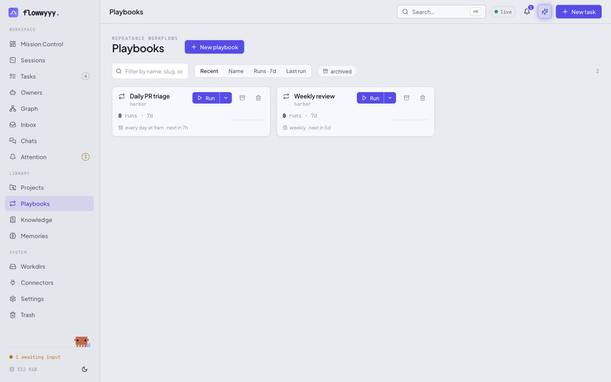
</p>

```
┌──────────┐  flow run playbook weekly-review
│ Playbook │ ────────▶ snapshot ─────▶ new task ─────▶ new session
│  brief   │           (frozen)                        (runs the snapshot)
└──────────┘
```

**Scheduling.** A playbook can carry a recurring schedule so it fires unattended:

```bash
flow update playbook <slug> --schedule "every day at 9am"   # or "every 6 hours", cron, etc.
flow update playbook <slug> --pause-schedule | --resume-schedule | --clear-schedule
```

Scheduled runs fire in `--auto` mode (headless, self-closing); manual runs open a
visible session. The scheduler skips a fire if a prior run is still in flight, and
catches up *once* (not per-missed-interval) after sleep/downtime.

## Knowledge base

Five markdown buckets under `~/.flow/kb/`, seeded by `flow init`:

| File | Holds |
|---|---|
| `user.md` | Your role, preferences, working style, constraints |
| `org.md` | Company, team, structure, people |
| `products.md` | What the org ships — product lines, modules, releases |
| `processes.md` | Tools, conventions, rituals, review rules |
| `business.md` | Customers, business model, deals, market |

They're lazy-loaded (read on demand, not at session start), append-only during
sessions, distilled mid-flight on long runs, and swept from the transcript on
`flow done`. `flow search "<query>" --in memories` locates a fact across all of
them. If you `git init` inside `~/.flow/`, add `kb/` to `.gitignore` — these
files hold personal/org-sensitive notes.

## Slack integration — react to triage

flowwyyy listens to a Slack workspace over Socket Mode and turns *your* reactions
into tasks. React to a thread with `:claude:` and a Claude session spins up bound
to that thread; react with `:codex:` and you get a Codex session. Same task model,
same KB, same UI — Slack as one more input channel.

```
                        Slack Socket Mode
                              │
                              ▼
   ┌─────────────────────────────────────────────────┐
   │  SlackListener (reaction_added / messages)      │
   │   • is reactor in FLOW_SLACK_SELF_USER_IDS?     │
   │   • is emoji in the trigger set?                │
   └────────────────┬────────────────────────────────┘
                    ▼
   ┌─────────────────────────────────────────────────┐
   │  Dispatcher                                     │
   │   • find task by slack-thread:<channel>:<ts>    │
   │   • create one if absent · pick provider        │
   │   • append to inbox · auto-open in Mission Ctrl │
   └─────────────────────────────────────────────────┘
```

**Why reactions, not slash commands.** Reactions are explicit consent from *your*
account, so a coworker's `:claude:` is harmless noise — only the IDs you list in
`FLOW_SLACK_SELF_USER_IDS` count.

**One thread, one task, forever.** flow tags each task with
`slack-thread:<channel>:<thread_ts>`; a second reaction on the same thread appends
to the existing task instead of duplicating.

**Following a reply into DMs.** When the agent (Claude or Codex) sends a DM, the
`PostToolUse` hook registers that DM thread on the task, so the recipient's
replies route back into the task's inbox — scoped to the DM thread the agent
started, not the person's whole DM channel. Requires the user-token DM event
subscriptions described below.

### Quick setup — the Connect Slack wizard (recommended)

Open **Mission Control → Connectors → Slack** (the plug icon). The wizard does the
whole dance in three resumable steps:

1. **Create the app** from an app-configuration token — flow calls Slack's
   manifest API and creates an app with every scope, event subscription, and
   Socket Mode already wired.
2. **App-level token** — a deep-linked paste (Slack has no API for this one).
3. **Install** — one click round-trips OAuth and hands flow the bot token, your
   user token (DM following), and your member ID in a single exchange.

> In default/localhost mode the OAuth redirect lands on a self-signed
> `https://localhost:8790` with a one-time certificate warning — click
> **Advanced → Proceed**. Configure [public ingress](#public-ingress) (zrok or
> your own URL) and the warning disappears.

### Manual setup

flow uses three Slack tokens: an **app-level token** (`xapp-…`) opens the Socket
Mode WebSocket, a **bot token** (`xoxb-…`) makes Web API reads, and a **user
token** (`xoxp-…`) unlocks DM following and backfill (the bot can't see *your*
DMs). Reactions and channel threads work with just the app + bot token.

<details>
<summary>App manifest (paste at api.slack.com/apps → From an app manifest)</summary>

```yaml
display_information:
  name: flow
  description: Turns your Slack reactions and replies into Claude/Codex work.
  background_color: "#1b1b1f"
features:
  bot_user:
    display_name: flow
    always_online: true
oauth_config:
  scopes:
    bot:
      - reactions:read      # see :claude:/:codex: reactions (the core trigger)
      - channels:history    # read public-channel thread replies
      - groups:history      # read private-channel thread replies
      - channels:read        # resolve channel name + members for titles
      - groups:read
      - users:read           # resolve author display names
      - files:read           # read text/PDF file-share bodies for attention context
      - app_mentions:read
      - im:read
      - im:history
      - im:write
      - mpim:read
      - chat:write           # post replies (only if you enable writes)
      - reactions:write
      - files:write
    user:
      - im:history           # receive + backfill 1:1 DMs (DM following)
      - mpim:history
      - channels:history     # user-scoped channel events + backfill
      - groups:history
      - im:read
      - mpim:read
      - channels:read
      - groups:read
      - users:read
      - files:read
      - chat:write           # post AS you (only if you enable writes)
      - files:write
settings:
  event_subscriptions:
    bot_events:
      - reaction_added
      - message.channels
      - message.groups
      - message.im
      - app_mention
    user_events:
      - message.im
      - message.mpim
      - message.channels
      - message.groups
  socket_mode_enabled: true
```

The `user_events` block is Slack's **"Subscribe to events on behalf of users"** —
it's the only way `message.im` / `message.mpim` reach flow. Reinstall the app
whenever you change scopes or events.

</details>

Give the tokens to flow via **Mission Control → Connectors → Slack** (Manual
tokens disclosure) or export before `flow ui serve`:

```bash
export FLOW_SLACK_APP_TOKEN=xapp-1-...          # app-level token (Socket Mode)
export FLOW_SLACK_TOKEN=xoxb-...                # bot token (Web API reads)
export FLOW_SLACK_USER_TOKEN=xoxp-...           # user token (DM following) — optional
export FLOW_SLACK_SELF_USER_IDS=U01ABCDEF       # your Slack member ID(s)
export FLOW_SLACK_TRIGGER_EMOJI=claude,codex    # optional; default is just "claude"
```

> **Run exactly one flow server per Slack app token.** Socket Mode routes each
> event to a single connected socket; a second `flow ui serve` would split your
> events. flow guards this with a machine-wide lock — extras show as
> **suppressed** in Mission Control.

### Slack configuration reference

| Setting key | Env aliases | Default | Purpose |
| ----------- | ----------- | ------- | ------- |
| `FLOW_SLACK_APP_TOKEN` | `SLACK_APP_TOKEN` | — | App-level token; **required** for Socket Mode |
| `FLOW_SLACK_TOKEN` | `SLACK_BOT_TOKEN`, `SLACK_TOKEN` | — | Bot token; **required** |
| `FLOW_SLACK_USER_TOKEN` | `SLACK_USER_TOKEN` | — | User token; DM following / backfill |
| `FLOW_SLACK_SELF_USER_IDS` | — | — | Member IDs whose reactions/messages count as *you* |
| `FLOW_SLACK_TRIGGER_EMOJI` | — | `claude` | Reaction shortname(s); comma-separate for routing |
| `FLOW_SLACK_SOCKET_MODE` | — | `true` | `0`/`false` keeps tokens configured but doesn't connect |
| `FLOW_SLACK_OPEN_TARGET` | — | `ui` | `ui` (browser terminal) or `iterm` (legacy tab) |
| `FLOW_SLACK_AUTOOPEN` | — | `true` | Open a session automatically on trigger |
| `FLOW_SLACK_WRITES_ENABLED` | — | `false` | Gate for posting back to Slack; **off** by default |

Secrets are write-only in the Settings UI — flow never reads a stored token back.
Without tokens, the rest of flow works unchanged; Slack is opt-in.

## GitHub integration — assigned work and review threads

flowwyyy ingests GitHub activity — assigned issues, assigned/review-requested
PRs, review comments, top-level reviews, head updates, merges, and closes — via
**signed webhook deliveries from a GitHub App**. GitHub POSTs to `POST
/api/github/webhook`; flow verifies the `X-Hub-Signature-256` HMAC, records the
delivery for idempotency, normalizes the payload, and dispatches it — **no GitHub
API call on the hot path, no `gh` CLI for the monitor**.

```
   GitHub ──signed POST──▶ /api/github/webhook ──▶ GitHubDispatcher
                            verify HMAC · dedup     • find task by gh-pr:/gh-issue: tag
                            normalize → event       • create if absent · pick provider
                                                     • append to inbox
```

**Setup — the Connect GitHub wizard.** Mission Control → **Connectors → GitHub**
builds a GitHub App manifest (webhook URL, generated signing secret, the
issue/PR events + write permissions), POSTs it to github.com, and receives the app
id, private key, and webhook secret in one shot — **secrets go to the OS keyring,
nothing pasted by hand.** It then guides installation. The wizard requires a
running [public ingress](#public-ingress) first (the webhook URL must be public at
creation). Personal and org install targets are both supported.

**Gap recovery is redelivery backfill.** If flow or the ingress was down, the
wizard's **Replay missed deliveries** button lists the App's hook deliveries and
replays the missed ones through the same pipeline, deduped by delivery GUID.

**One GitHub item, one task.** PR tasks are tagged `gh-pr:<owner>/<repo>#<n>`,
issue tasks `gh-issue:<owner>/<repo>#<n>`. Later activity appends to the existing
task. A `CHANGES_REQUESTED` review or new head SHA reopens a done task; a merge
marks it done; approvals are recorded but don't reopen. **Provider routing:** add
`flow:codex` or `flow:claude` labels (defaults to Claude).

| Env var | Purpose |
| --- | --- |
| `FLOW_GH_TRANSPORT` | `webhook` (set by the wizard) or `off` to disable ingress |
| `FLOW_GH_WEBHOOK_SECRET` | HMAC secret (wizard-set in keyring; env is a back-compat override) |
| `FLOW_GH_SELF_LOGINS` | GitHub logins that count as you (recognize self-authored items) |
| `FLOW_GH_AUTOOPEN` | `0` to create tasks without auto-opening a terminal |

App credentials (`FLOW_GH_APP_PEM`, webhook secret, client secret) live in the OS
keyring; ids/slugs are Hidden settings — you never hand-edit them.

## Public ingress

Some connectors need an external service to reach flow inbound over a real public
HTTPS URL — Slack's OAuth redirect and GitHub's webhook POSTs. Public ingress is
one reusable abstraction for both. flow keeps running locally; the outside world
sees a normal HTTPS URL; flow still validates everything itself (OAuth `state`,
GitHub HMAC, token exchanges) and exposes *only* the connector callback paths —
never the Mission Control UI or data API.

Pick a provider with `FLOW_INGRESS_PROVIDER`:

| Provider | Public URL from | Use when |
| -------- | --------------- | -------- |
| `none` *(default)* | — | Slack-only, accepting the localhost cert warning |
| `zrok` | generated at runtime by [zrok](https://zrok.io) | you want a public URL without running a server |
| `manual` | `FLOW_PUBLIC_BASE_URL` you set | you already front flow with your own proxy/tunnel |

**zrok (recommended).** flow embeds the zrok Go SDK — no binary to install, no
subprocess. Enable your environment once (`zrok enable <token>`), set
`FLOW_INGRESS_PROVIDER=zrok`, `FLOW_ZROK_SHARE_NAME=<stable-unique-name>` (so the
URL survives restarts — required, since Slack/GitHub register the callback once),
and `FLOW_ZROK_AUTO_START=true`. Check live state at `GET /api/ingress/status`.

## Settings & configuration

One configuration system shared by the CLI, the listeners, and Mission Control.
Resolution, highest priority first:

1. **`~/.flow/config.json`** (what the Settings UI writes; `0600`) — wins over
   everything.
2. **Shell environment** — used when config.json doesn't set the key.
3. **Built-in default.**

At boot the server exports every config.json value into its own environment, so
the rest of the code (which reads `os.Getenv`) honors UI-managed values
uniformly. Saving a Slack or GitHub key **hot-restarts** that listener. Secrets
are write-only; an empty field means "leave unchanged."

| Setting key | Type | Default | Purpose |
| --- | --- | --- | --- |
| `FLOW_STALE_DAYS` | int | `3` | In-progress sessions quiet longer than this are flagged **stale** |
| `FLOW_MODEL_TIER` | enum | `medium` | Default model tier (see [session model](#which-model-a-session-launches-with)) |
| `FLOW_MODEL_AUTODOWNSHIFT` | bool | `on` | Downshift the tier for richly-specified briefs |
| `FLOW_MISSION_QUOTE` | bool | `true` | Show the rotating quote beside the greeting |

> **Runtime env vars (not settings)**, read per-invocation: `FLOW_ROOT` (override
> `~/.flow/`), `FLOW_TERM` (`warp`/`iterm`/`terminal`/`zellij`/`kitty`),
> `FLOW_PROJECT` / `FLOW_TASK` (injected into spawned sessions), `FLOW_HOOK_OWNED`
> (marks a flow-owned terminal for the Codex agent-hooks gate). These belong in
> your shell rc, not config.json.

## Your data — local, portable, yours

Everything lives under `~/.flow/` (override with `$FLOW_ROOT`). No server, no
cloud, no telemetry. Plain markdown beside a SQLite index — readable in any
editor, versionable in git.

```
~/.flow/
  flow.db                          # SQLite index — projects, tasks, playbooks, owners
  kb/  user.md org.md products.md processes.md business.md
  projects/<slug>/  brief.md  updates/YYYY-MM-DD-*.md
  tasks/<slug>/     brief.md  updates/*.md  inbox.jsonl
  playbooks/<slug>/ brief.md  updates/*.md
  owners/<slug>/    charter.md updates/*.md
```

The SQLite database is an *index*, not the source of truth — every entity's real
content is in the markdown beside it; you could delete `flow.db` and rebuild from
the markdown.

**Backup & sync.** Git (`cd ~/.flow && git init && git add . && git commit`; add
`kb/` to `.gitignore` if you push to a shared remote), Time Machine, or a synced
folder via symlink. ⚠️ Don't run flow on two machines simultaneously through a
synced folder — SQLite doesn't tolerate concurrent writes from separate hosts. To
move machines: copy `~/.flow/` over, install the binary, run `flow init` once.

## Building from source

The released binary is self-contained — most users never build flowwyyy. If
you're hacking on it (or the Mission Control UI):

**Prerequisites:** Go 1.25+ (the SQLite driver is pure Go — `modernc.org/sqlite`,
**no CGO**, no C toolchain). Node 18+ and [pnpm](https://pnpm.io) *only* if you're
building the UI (Vite + React + TypeScript under `internal/server/ui/`).

| Target | What it does |
| ------ | ------------ |
| `make build` | Builds `./flow`. Auto-builds the UI first if the bundle is missing, otherwise a fast Node-free Go build. |
| `make ui` | Rebuilds the web UI into `internal/server/static/`. Run after editing UI source. |
| `make rebuild` | `make ui` then `make build` — the one-shot after touching `internal/server/ui`. |
| `make install` | Builds, copies the binary to `~/.local/bin/flow`, offers to add it to `PATH`, installs the skill + hook. Then run `flow init`. |
| `make test` | `go test ./...` — fast, no network, externals mocked. |

The Go server embeds `static/` at compile time (`//go:embed all:static`) and
serves it at `/`. The hashed JS/CSS bundles under `static/assets/` are gitignored
and regenerated by `make ui`; `make build` detects a missing bundle and runs the
UI build for you, so a clean clone Just Works (the first build is slower). For
hot-reload UI work: run `flow ui serve` on `:8787`, then `pnpm dev` in
`internal/server/ui` for a Vite dev server proxying `/api` and `/ws`.

## Relationship to upstream flow

flowwyyy is a personal fork of [`flow`](https://github.com/Facets-cloud/flow),
diverged substantially. It tracks no upstream remote — it's its own project now —
but it stays **backward-compatible** with flow's CLI surface and on-disk layout,
so flow's skill, briefs, KB, and `~/.flow/` data all work unchanged. The headline
additions on top of flow: Mission Control (the browser UI), the Attention Router,
owners and autonomous runs, webhook-based GitHub ingress, zrok public ingress,
provider-handoff forks, FTS search, the KB distiller, and per-task model
selection. Credit for the foundation goes to the original flow.

## Where flowwyyy runs (and where we'd love help)

Today flowwyyy runs on **macOS (iTerm2, Warp, stock Terminal.app, kitty, Ghostty,
or zellij) + Claude Code or Codex** — that's the stack it was built and tested
against. zellij and kitty work on Linux too. The architecture is portable —
session spawning is one small package, agent providers are pluggable via
`internal/agents/` — but other harnesses (Cursor, Aider, plain shell) and other
terminals (Linux + tmux/wezterm, Windows Terminal) need contributors who run
those stacks daily. If that's you, [a PR is very welcome](CONTRIBUTING.md).

## Docs & contributing

- [Contributing](CONTRIBUTING.md) — bug reports, PRs, dev setup
- [Changelog](CHANGELOG.md)
- [Security](SECURITY.md) — how to report issues
- [Code of Conduct](CODE_OF_CONDUCT.md)

## License

[MIT](LICENSE) — built on [flow](https://github.com/Facets-cloud/flow) by Facets Cloud.
