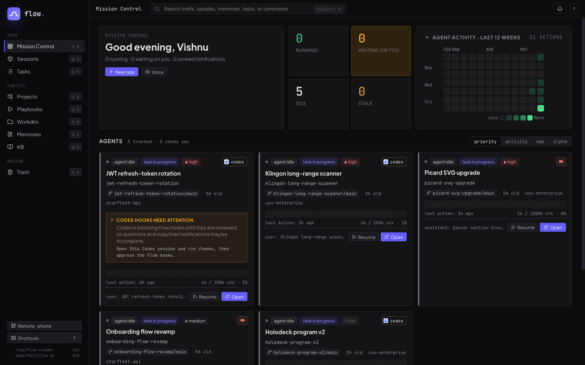
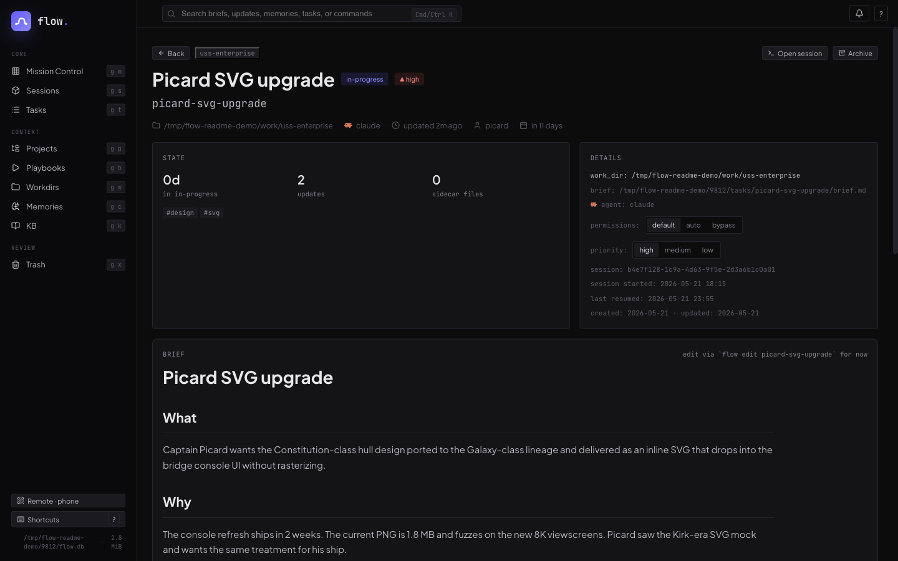
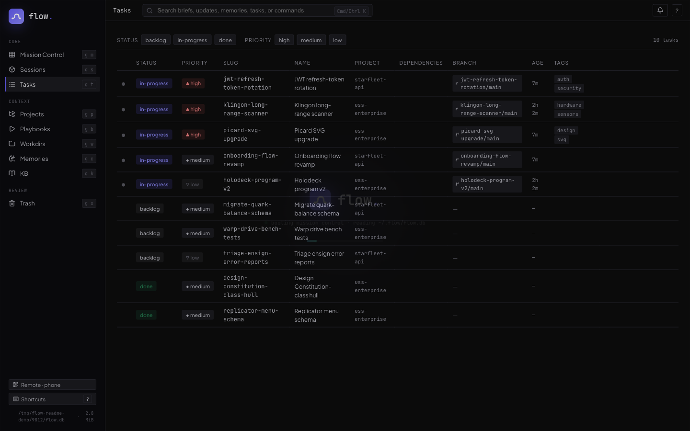
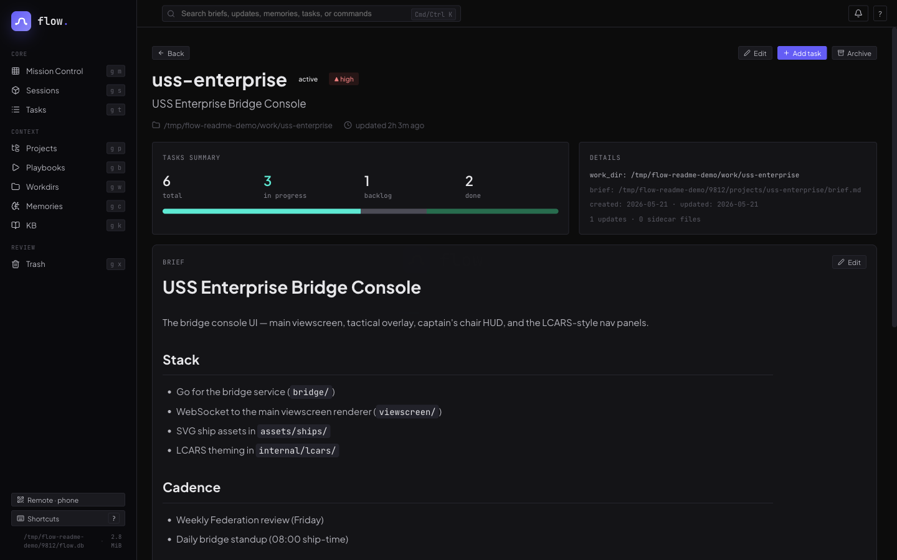
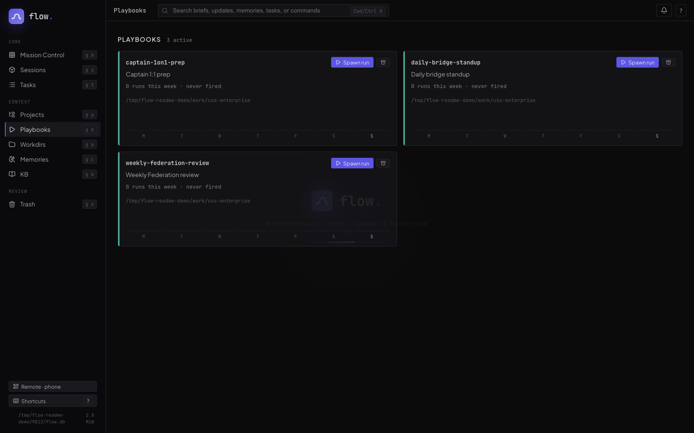
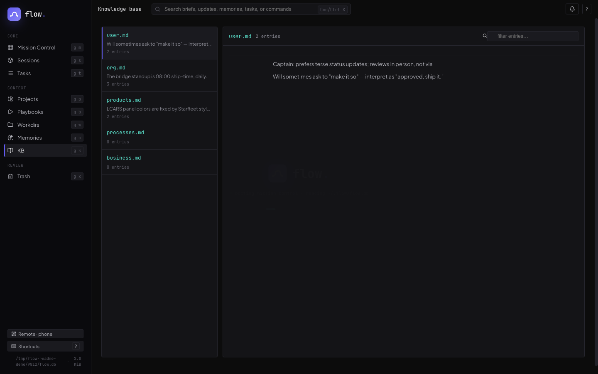

<p align="center">
  
</p>

<p align="center">
  
  
</p>

> A complete task manager for **Claude Code and Codex** — with
> first-class **Slack** triggers, a browser-based **Mission Control**,
> and a working memory layer that turns every session from a brilliant
> new hire into the engineer on your team.

This README captures the current state. flow ships new features
weekly — what's documented below is the floor, not the ceiling. The
[changelog](CHANGELOG.md) carries every release.

## See it in action

A four-act demo of how flow compounds context across days and tasks.
The work is silly on purpose — Star Trek bridge starships — so the
mechanic is what you watch, not the code.

**Act 1 — Capture the work.** Just talk. flow interviews you for
what / why / where / done-when, drafts a structured brief, and opens
a dedicated Claude session for the task in a new tab.


**Act 2 — Work, then park.** The session has the brief, the project
context, and the knowledge base loaded. You build until you hit a
blocker — here, "Kirk needs to review this" — and tell Claude to
park it. Status flips to `waiting`. Tab can close.


**Act 3 — Resume and close.** A day later you say "Kirk signed off."
Same session resumes with full memory of where it left off. `flow
done` flips status and triggers the sweep — Claude re-reads the
whole transcript and writes durable facts (Kirk approved the design,
the ship class, the conventions used) into the knowledge base.


**Act 4 — Months later, a new captain.** New task: "Picard's the new
boss, he wants the starship as an SVG." Brand new session, but it
already knows the ship, knows the design choices Kirk approved,
knows the project conventions — because the KB carried it. Claude
just gets to work.


That fourth session is what flow is really about. Not the first
session — the fiftieth.

## Why flow

If you use Claude Code daily, you've felt the ceiling: every session
is a new hire. Brilliant, capable, ready to help — but with no memory
of yesterday's decisions, last week's migrations, or the half-finished
threads in your other tabs. You spend the first ten minutes of every
session catching it up.

flow changes the relationship. It's a complete task manager —
projects, tasks, structured briefs, progress notes, playbooks for
recurring work — *and* a working memory layer that injects all of it
into every Claude session automatically. Capture once, work with
Claude on it forever.

The first session feels normal. By session ten, Claude knows your
codebase quirks, your team, the customer you keep mentioning, and
the migration you're three steps into. By session fifty, it's the
engineer on your team — not a new hire you re-explain yourself to
every morning.

Built for power users who want Claude to *work with them*, not just
*help them*.

## How context compounds

Every task feeds the same knowledge base. Every closed task makes
the next one smarter.

```
                                       ┌────────────────────────┐
                                       │   ~/.flow/kb/          │
                                       │   user · org · products│
                                       │   processes · business │
                                       └─────▲──────────▲───────┘
                                             │          │
                  flow do <task>             │ scoop    │ sweep
   ┌────────┐  ─────────────────▶  ┌─────────┴──────────┴─────┐
   │  Task  │                      │      Claude session      │
   │  brief │  ◀──── updates ───── │  loads brief + kb +      │
   │ +notes │                      │  notes + repo conventions│
   └────────┘  ─── flow done ───▶  └──────────────────────────┘
                                       (auto-sweep transcript
                                        into kb on done)
```

- **Scoop (live):** during a session the flow skill listens for
  durable facts you mention — your role, a teammate's name, a
  product convention — and appends them to the matching kb file
  on the fly.
- **Sweep (on `flow done`):** when you close a task, flow spawns
  a headless Claude pass that re-reads the entire transcript and
  pulls anything kb-worthy that the live scoop missed. The status
  flip is the contract; the sweep is best-effort.
- **Cross-reference:** `flow transcript <sibling-task>` lets a
  current session read what was decided in a related one — useful
  when the brief alone doesn't carry enough context.

Net effect: the longer you use flow, the more your knowledge base
grows, the less you re-explain yourself.

## Playbooks for the work you do on cadence

Some work repeats. Weekly reviews. Daily PR triage. On-call rotations.
Customer-meeting prep.

A **playbook** is a reusable run definition — a markdown brief that
describes what a run does. `flow run playbook weekly-review` snapshots
that brief into a fresh task and spawns a new Claude session against
it. Every run is reproducible (it executes against a frozen snapshot,
so editing the playbook later doesn't rewrite history) and contributes
back to the knowledge base on `flow done` like any other task.

```
┌──────────┐  flow run playbook weekly-review
│ Playbook │ ────────▶ snapshot ─────▶ new task ─────▶ new session
│  brief   │           (frozen for                     (executes
└──────────┘            reproducibility)                against snapshot)
```

Same compounding mechanic — your weekly review session two months from
now will know everything every prior weekly review surfaced.

## Mission Control — flow in the browser

`flow ui serve` boots a local web app at `127.0.0.1:8787`. Same
SQLite, same markdown briefs, same skill — just a richer surface for
the things terminals don't do well: side-by-side task lists, an
Attention-aware briefing, inline brief editing, live agent status, and
a browser-attached terminal that streams the Claude or Codex session
over WebSocket.



Mission Control is a peer to the CLI, not a replacement. It reads and
writes the same `~/.flow/flow.db`, so the browser, your terminal
sessions, and the bundled skill always see one consistent view.

### Cmd+K everything

A global palette with FTS5 over briefs, updates, memories, tasks, and
commands. Type a few letters and jump. Press Enter and you're either
on the task detail page or directly attached to its live terminal.


### Task detail with inline editors

Every task has a single page that shows status, priority, due date,
tags, agent provider (Claude or Codex), permission mode (default /
auto / bypass), session id, brief, and append-only updates. Priority
and permission mode are segmented controls — one click to change. New
task sessions default to `auto`; choose `default` when you want the
provider's prompt-on-request behavior.



### Projects, playbooks, and a tasks table

Every entity has a list and a detail page. The tasks table filters
on status and priority; project pages roll up task breakdowns;
playbook pages show the frozen brief that each run snapshots from.

<table>
<tr>
<td width="33%"><a href="docs/ui/06-tasks-list.png"></a><br><em>Tasks — filterable list</em></td>
<td width="33%"><a href="docs/ui/07-project-detail.png"></a><br><em>Project detail</em></td>
<td width="33%"><a href="docs/ui/05-playbooks.png"></a><br><em>Playbooks</em></td>
</tr>
</table>

### Knowledge base browser

Five markdown buckets — user, org, products, processes, business —
rendered as a two-pane reader. Scoop appends to these during
sessions; sweep adds more on `flow done`.



### Browser-attached terminal

The biggest reason to leave the CLI: when an agent is mid-tool-call
or waiting for input, the browser shows it. Click *Open session* on
any task and an xterm.js terminal streams the live Claude or Codex
session — same scrollback, same input. Reload the tab and the
snapshot syncs back.

### Same-session inbox monitor

Every monitored source writes normalized events to the task's
`~/.flow/tasks/<slug>/inbox.jsonl`. When that task has a live Flow-owned
terminal session, flow starts a task-local monitor that watches the
inbox and sends a short wake prompt into the same Claude or Codex
session. The monitor is generic: Slack, GitHub, and future sources use
the same append-to-inbox contract, and the agent continues the work in
place instead of spawning a separate solver.

Provider capability note: Claude Code's native background sessions are separate from Flow's monitor.
Codex currently exposes experimental app-server/remote-control building blocks, not a guaranteed Claude-style background scheduler that Flow can depend on.
Therefore Flow's supported path for both providers is the task-local inbox monitor + Flow-owned terminal wake; any native provider backend should be an opt-in integration behind this contract.

### What it doesn't do

No auth, no TLS, loopback only. Mission Control is a *local* tool —
if you want it on a public network, put your own auth in front. The
binary refuses to bind to non-loopback hosts without an explicit
`--host` flag for exactly this reason.

## Slack integration — react to triage

flow listens to a Slack workspace over Socket Mode and turns *your*
reactions into tasks. React to a thread with `:claude:` and a Claude
session spins up bound to that thread; react with `:codex:` and you
get a Codex session instead. Same task model, same KB, same UI —
just with Slack as one more input channel.

```
                        Slack Socket Mode
                              │
                              ▼
   ┌─────────────────────────────────────────────────┐
   │  monitor.SlackListener   (parses reaction_added)│
   └────────────────┬────────────────────────────────┘
                    │  is reactor in FLOW_SLACK_SELF_USER_IDS?
                    │  is emoji in trigger set?
                    ▼
   ┌─────────────────────────────────────────────────┐
   │  DecideReaction   → (channel, thread_ts, emoji) │
   └────────────────┬────────────────────────────────┘
                    │
                    ▼
   ┌─────────────────────────────────────────────────┐
   │  Dispatcher                                     │
   │   • find task by slack-thread:<channel>:<ts>    │
   │   • create one if absent                        │
   │   • pick provider: :claude: → claude            │
   │                    :codex:  → codex             │
   │   • append to inbox · auto-open in Mission Ctrl │
   └─────────────────────────────────────────────────┘
```

**Why reactions, not slash commands.** Slash commands let anyone in the
channel trigger you. Reactions are explicit consent from *your*
account, so a coworker's `:claude:` is harmless noise — only the IDs
you list in `FLOW_SLACK_SELF_USER_IDS` count.

**Per-emoji provider routing.** A `:claude:` reaction routes to a Claude
session; a `:codex:` reaction routes to Codex. Both pre-existing custom
emojis (e.g., `:flow-claude:`) and the literal `claude` / `codex`
shortnames are supported. Set extras via `FLOW_SLACK_TRIGGER_EMOJI`
(comma- or whitespace-separated, with or without colons).

**One thread, one task, forever.** flow tags each task with
`slack-thread:<channel>:<thread_ts>`. A second reaction on the same
thread won't create a duplicate — it appends to the existing task's
inbox. The task title is built from the message author's display
name and the first line of the message; if Slack's `channels:read`
scope is missing, flow falls back to the author name alone rather
than erroring.

**Following a reply into DMs.** Sometimes the agent is asked to answer
someone *privately* rather than in the thread. flow follows that DM
**automatically** and for **both providers**: when the agent (Claude or
Codex) sends a DM, the `PostToolUse` agent hook sees the `slack_send_message`
tool call, reads its channel + `thread_ts`, and registers the DM **thread**
on the task as `slack-thread:<dm-channel>:<thread_ts>`. The recipient's
replies in that thread then route through the same thread-matching path as a
channel reply, into the task's `inbox.jsonl`.

Monitoring is scoped to the **DM thread** the agent started — not the
person's whole DM channel — so unrelated conversations with the same person
never leak into the task. Registering at the tool-use hook is deterministic:
it doesn't depend on the agent self-tagging, on a fresh brief, or on any
"sent via Claude" marker (which Slack renders at display time and does *not*
include in the Events API payload).

This requires the Slack app to receive the user's DM events: under **Event
Subscriptions → "Subscribe to events on behalf of users"**, add `message.im`
(and `message.mpim` for group DMs), backed by the matching `im:history` /
`mpim:history` user-token scopes, then reinstall the app. A user token
(`FLOW_SLACK_USER_TOKEN` / `SLACK_USER_TOKEN`) is also used to backfill DM
threads across restart gaps — the bot can't read the operator's DMs.
Duplicate socket deliveries (the same event seen by both the bot and the
user) are collapsed by `(channel, ts)` at inbox-append time.

### Quick setup — the Connect Slack wizard (recommended)

Open **Mission Control → Connectors → Slack** (`flow ui serve`, then the
plug icon in the sidebar). The wizard does the whole dance in three steps
and is resumable at any point — reload the page and it picks up where you
left off:

1. **Create the app.** Mint an *app configuration token* at
   <https://api.slack.com/apps> ("Your App Configuration Tokens" →
   Generate → copy the `xoxe.xoxp-…` access token; it lives 12 hours and
   is only used during setup). Paste it — flow calls Slack's manifest API
   and creates an app with every scope, event subscription, and Socket
   Mode already wired. No YAML, no checkbox safari.
2. **App-level token.** Slack has no API for this one, so it's a
   deep-linked paste: the wizard links straight to your new app's
   Basic Information page — generate a token with `connections:write`,
   paste it back, and flow verifies it against Slack before saving.
3. **Install.** One click opens Slack's consent screen. Approving it
   round-trips through a local HTTPS callback and hands flow the bot
   token, your user token (DM following), *and* your member ID in a
   single OAuth exchange — nothing to copy, nothing to look up.

> **The one rough edge (default / localhost mode):** the OAuth redirect
> lands on `https://localhost:8790` with a locally-generated certificate, so
> your browser shows a one-time "connection is not private" warning — click
> **Advanced → Proceed**. Slack mandates an HTTPS redirect URL; the
> authorization code never leaves your machine. Configure
> [public ingress](#public-ingress--public-callback-urls-for-connectors) (zrok
> or your own URL) and this warning disappears — the redirect lands on a real
> public HTTPS URL instead. The wizard detects the mode and adjusts its copy.

When the wizard turns green, react to any Slack message with `:claude:`
and a session opens. Scope changes later? Hit **Reinstall** on the same
card. Prefer doing everything by hand instead — or want to know exactly
what the wizard wires up? The manual walkthrough below is the same result,
step by step.

### Setting up the Slack app manually — step by step

flow talks to Slack over **Socket Mode** (an outbound WebSocket — no
public URL, no inbound webhook, works behind a firewall) and consumes the
**Events API** over that socket. The walkthrough below gets you from zero
to a working integration. Do it once.

> **One concept first.** Slack has *three* kinds of token and flow uses all
> three. An **app-level token** (`xapp-…`) opens the Socket Mode WebSocket.
> A **bot token** (`xoxb-…`) makes Web API reads (channel/thread/user
> lookups). A **user token** (`xoxp-…`) is what unlocks DM following and DM
> backfill, because the bot can't see *your* DMs — only you can. Reactions
> and public/private channel threads work with just the app + bot token;
> the user token is only needed once you want flow to follow DMs.

#### 1. Create the app (fastest path: paste a manifest)

Go to <https://api.slack.com/apps> → **Create New App** → **From an app
manifest** → pick your workspace → paste the YAML below. This wires Socket
Mode, every event subscription, and every OAuth scope flow uses in one shot.
(Prefer clicking? Skip to the scope/event reference tables further down and
toggle them by hand — the manifest just front-loads that work.)

```yaml
display_information:
  name: flow
  description: Turns your Slack reactions and replies into Claude/Codex work.
  background_color: "#1b1b1f"
features:
  bot_user:
    display_name: flow
    always_online: true
  app_home:
    home_tab_enabled: false
    messages_tab_enabled: true
    messages_tab_read_only_enabled: false
oauth_config:
  scopes:
    bot:
      - reactions:read      # see :claude:/:codex: reactions (the core trigger)
      - channels:history    # read public-channel thread replies (live monitor)
      - groups:history      # read private-channel thread replies
      - channels:read       # resolve channel name + members for task titles
      - groups:read         # same, for private channels
      - users:read          # resolve author display names for titles/inbox
      - files:read          # read text/PDF file-share bodies for attention context
      - app_mentions:read   # receive @flow mentions
      - im:read             # DM metadata (optional, see notes)
      - im:history          # bot's own DMs; user-scope im:history below covers the operator's DMs
      - im:write            # resolve/open operator↔bot IM via conversations.open
      - mpim:read           # group-DM metadata (optional, see notes)
      - chat:write          # post replies back to Slack (only if you enable writes)
      - reactions:write     # add reactions back (only if you enable writes)
      - files:write         # upload attachments via `flow slack send --file` (only if you enable writes)
    user:
      - im:history          # receive + backfill 1:1 DMs (DM following)
      - mpim:history        # receive + backfill group DMs (DM following)
      - channels:history    # user-scoped channel events + backfill (your membership)
      - groups:history      # user-scoped private-channel events + backfill
      - im:read             # enumerate your DMs for backfill (else: missing_scope)
      - mpim:read           # enumerate your group DMs for backfill
      - channels:read       # resolve channel metadata on the user token
      - groups:read         # same, private channels
      - users:read          # resolve author names on the user token
      - files:read          # read text/PDF file-share bodies in DMs/MPIMs
      - chat:write          # post AS you (FLOW_SLACK_SEND_AS=user / --as user) — only if you enable writes
      - files:write         # upload attachments AS you (flow slack send --as user --file) — only if you enable writes
settings:
  event_subscriptions:
    bot_events:
      - reaction_added
      - message.channels
      - message.groups
      - message.im           # bot receives DMs sent directly to it
      - app_mention
    user_events:
      - message.im
      - message.mpim
      - message.channels    # channel msgs via YOUR membership (bot need not join)
      - message.groups
  socket_mode_enabled: true
  org_deploy_enabled: false
  token_rotation_enabled: false
```

The `user_events` block is what the README elsewhere calls **"Subscribe to
events on behalf of users"** — it is *separate* from `bot_events` and is the
only way `message.im` / `message.mpim` reach flow. Scopes alone don't deliver
events; the event subscription is what does.

#### 2. Create the app-level token (Socket Mode)

The manifest turns Socket Mode *on* but does **not** create the token for it.
Go to **Settings → Basic Information → App-Level Tokens → Generate Token and
Scopes**:

- Name it anything (e.g. `socket`).
- Add the **`connections:write`** scope (this is what Socket Mode needs).
- Generate it. Copy the **`xapp-…`** value → this is `FLOW_SLACK_APP_TOKEN`.

#### 3. Install the app and grab the bot + user tokens

Go to **Settings → Install App** → **Install to Workspace** → approve. Then,
under **OAuth & Permissions → OAuth Tokens**:

- **Bot User OAuth Token** (`xoxb-…`) → `FLOW_SLACK_TOKEN`.
- **User OAuth Token** (`xoxp-…`) → `FLOW_SLACK_USER_TOKEN` *(only present if
  you kept the `user` scopes; required for DM following)*.

> **Reinstall whenever you change scopes or events.** Slack only grants new
> scopes / starts delivering new event types after a reinstall. If you edit
> the manifest or toggle a checkbox later, hit **Install to Workspace** again
> or flow will silently never see the new events.

#### 4. Find your own Slack user ID

flow only acts on reactions from *you* (so a coworker's `:claude:` is harmless
noise). In Slack, click your profile → **⋮** → **Copy member ID** (looks like
`U01ABCDEF`). That's `FLOW_SLACK_SELF_USER_IDS` (comma-separate if you have
more than one identity).

#### 5. Give the tokens to flow

Easiest: open **Mission Control → Connectors → Slack** (`flow ui serve`, then
the plug icon) and paste the three tokens + your user ID — the token fields
live under the card's **Manual tokens** disclosure. flow writes them to
`~/.flow/config.json` and restarts the listener live — no server bounce.
Values persisted this way always win over shell env vars.

Prefer the shell? Export them before `flow ui serve` instead:

```bash
export FLOW_SLACK_APP_TOKEN=xapp-1-...          # app-level token (Socket Mode)
export FLOW_SLACK_TOKEN=xoxb-...                # bot token (Web API reads)
export FLOW_SLACK_USER_TOKEN=xoxp-...           # user token (DM following) — optional
export FLOW_SLACK_SELF_USER_IDS=U01ABCDEF       # your Slack member ID(s)
export FLOW_SLACK_TRIGGER_EMOJI=claude,codex    # optional; default is just "claude"
flow ui serve
```

#### 6. Verify it's actually connected

`flow ui serve` logs to stderr (and to `~/.flow/logs/ui-serve.log` when run
with `--bg`). A healthy start looks like:

```
[slack listener] started (Socket Mode connecting)
[slack listener] hello received
[slack listener] connected
```

Mission Control surfaces the same state (connecting / connected / suppressed)
so you can confirm at a glance. Now react to any thread with `:claude:` — a
task should appear and a session should open.

#### Scope → feature reference

If you'd rather hand-pick scopes than paste the manifest, here's what each one
buys you. The **core trigger** works with the first row alone; everything else
is incremental.

| Token | Scope | Unlocks |
| ----- | ----- | ------- |
| **App** (`xapp-`) | `connections:write` | The Socket Mode WebSocket itself — nothing works without it |
| **Bot** (`xoxb-`) | `reactions:read` | Seeing your `:claude:` / `:codex:` reaction — the core trigger |
| Bot | `channels:history`, `groups:history` | Streaming new thread replies into the task inbox (public / private) |
| Bot | `channels:read`, `groups:read`, `users:read` | Building nice task titles ("Alice — fix the deploy") instead of falling back to bare IDs |
| Bot | `files:read` | Reading text/PDF file-share bodies in watched channels for attention context and security reporting |
| Bot | `app_mentions:read` | Reacting to `@flow` mentions |
| Bot | `im:read`, `mpim:read` | DM metadata lookups (optional — most DM work uses the user token) |
| Bot | `chat:write`, `reactions:write`, `files:write` | Posting replies / reactions / file attachments (`flow slack send --file`) *back* to Slack — only used if you set `FLOW_SLACK_WRITES_ENABLED=1` (off by default) |
| **User** (`xoxp-`) | `im:history`, `mpim:history` | **DM following** — receiving and backfilling DM replies the bot can't see |
| User | `im:read`, `mpim:read` | **Enumerating your DMs for backfill** — without these the DM backfill fails with `missing_scope` and only catches DMs that already have a watermark |
| User | `channels:history`, `groups:history` | Channel events + backfill via **your** membership — covers watched channels the bot was never invited to (flow dedups vs. the bot's by `(channel, ts)`) |
| User | `channels:read`, `groups:read`, `users:read` | Channel/author metadata resolution on the user token |
| User | `files:read` | Reading text/PDF file-share bodies in DMs/MPIMs for attention context and security reporting |
| User | `chat:write`, `files:write` | Posting messages / uploading attachments *as you* (`FLOW_SLACK_SEND_AS=user`, `flow slack send --as user [--file]`) — only used if you set `FLOW_SLACK_WRITES_ENABLED=1` |

#### Event → feature reference

| Event | Side | Feature |
| ----- | ---- | ------- |
| `reaction_added` | bot | The trigger — your reaction creates/opens a task |
| `message.channels` | bot | New public-channel thread replies wake the session |
| `message.groups` | bot | Same, private channels |
| `app_mention` | bot | `@flow` mentions |
| `message.im` | **user** | 1:1 DM replies wake the session (DM following) |
| `message.mpim` | **user** | Group-DM replies wake the session |

### Configuration reference (env / Settings UI)

Every key below is settable in **Mission Control → Settings** (persisted to
`~/.flow/config.json`) *or* as an environment variable. Secrets are
write-only in the UI — flow never reads them back. The `SLACK_*` column lists
shell-env aliases that also resolve (handy if you already export standard
Slack vars), but the Settings UI always reads/writes the `FLOW_SLACK_*` key.

| Setting key | Env aliases | Default | Purpose |
| ----------- | ----------- | ------- | ------- |
| `FLOW_SLACK_APP_TOKEN` | `SLACK_APP_TOKEN` | — | App-level token (`xapp-…`); **required** for Socket Mode |
| `FLOW_SLACK_TOKEN` | `SLACK_BOT_TOKEN`, `SLACK_TOKEN` | — | Bot token (`xoxb-…`) for Web API reads; **required** |
| `FLOW_SLACK_USER_TOKEN` | `SLACK_USER_TOKEN` | — | User token (`xoxp-…`); required for DM following / DM backfill |
| `FLOW_SLACK_WRITE_TOKEN` | `SLACK_WRITE_TOKEN` | — | Optional dedicated "post on my behalf" token; falls back to the bot/user token |
| `FLOW_SLACK_SELF_USER_IDS` | — | — | Comma-separated Slack member IDs whose reactions/messages count as *you* (the operator) |
| `FLOW_SLACK_SELF_BOT_USER_IDS` | `FLOW_SLACK_SELF_BOT_USER_ID` | — | Comma-separated Slack user IDs of flow's **own bot** (`U…`). Pins self-echo detection so flow drops its own posted messages (acks, digests, status) instead of surfacing them in the steerer. Auto-resolved from a `xoxb-` write/bot token; set explicitly only in user-token-only deployments where it can't be |
| `FLOW_SLACK_TRIGGER_EMOJI` | — | `claude` | Reaction shortname(s) that spawn a session; comma-separate for routing, e.g. `claude,codex` |
| `FLOW_SLACK_SOCKET_MODE` | — | `true` | Set `0`/`false` to leave tokens configured but not connect |
| `FLOW_SLACK_OPEN_TARGET` | — | `ui` | `ui` (browser terminal) or `iterm` (legacy iTerm tab) |
| `FLOW_SLACK_AUTOOPEN` | — | `true` | Open a session automatically when a thread is triggered |
| `FLOW_SLACK_WRITES_ENABLED` | — | `false` | Gate for posting back to Slack; **off** by default |
| `FLOW_SLACK_API_BASE_URL` | — | `https://slack.com/api` | Override the Slack API base (testing / proxies only) |
| `FLOW_SLACK_OAUTH_PORT` | — | `8790` | Loopback port for the wizard's HTTPS OAuth callback **in default/localhost mode only**. Must not change after app creation — the redirect URL is registered in the app manifest. Ignored when [public ingress](#public-ingress--public-callback-urls-for-connectors) is configured (the callback then lands on the main server). |

Three more keys — `FLOW_SLACK_APP_ID`, `FLOW_SLACK_CLIENT_ID`,
`FLOW_SLACK_CLIENT_SECRET` — are written by the Connect Slack wizard
(the app it created and that app's OAuth credentials). They're persisted in
`config.json` but deliberately hidden from the Settings form: hand-editing
them only breaks the wizard's app pairing.

The listener starts automatically when `flow ui serve` runs with the app +
bot tokens set and `FLOW_SLACK_SOCKET_MODE` not disabled. Without tokens, the
rest of flow works unchanged — Slack is opt-in.

> **Run exactly one flow server on a given Slack app token.** Socket Mode
> routes each event to a *single* connected socket, so a second `flow ui
> serve` (a stray smoke-test server, a worktree build) would split — and
> possibly drop — your events into the wrong task inboxes. flow guards this
> with a machine-wide flock keyed on the app token: the first process wins
> the slot and the rest show as **suppressed** in Mission Control rather than
> fighting for events. If Slack looks dead, check for a second flow process.

#### Troubleshooting

| Symptom | Likely cause |
| ------- | ------------ |
| Log shows `connection error` right after start | App not installed to the workspace, `xapp-` token missing the `connections:write` scope, app/user tokens from *different* apps, or admin approval pending |
| `not starting: SocketModeEnabled() is false` | App or bot token missing, or `FLOW_SLACK_SOCKET_MODE=0` |
| Listener `suppressed` in Mission Control | Another flow process already holds the Socket Mode lock for this app token — stop it |
| Reactions do nothing | Your member ID isn't in `FLOW_SLACK_SELF_USER_IDS`, or the emoji isn't in `FLOW_SLACK_TRIGGER_EMOJI` |
| Thread replies don't wake the session | Missing `channels:history` / `groups:history`, or you changed scopes without reinstalling |
| DM replies don't wake the session | No user token, or `message.im` / `message.mpim` not subscribed under "on behalf of users", or app not reinstalled after adding them |
| Task titles show raw IDs instead of names | Missing `channels:read` / `users:read` — flow falls back to the author ID rather than erroring |

## Public ingress — public callback URLs for connectors

Some connectors need an external service to reach flow *inbound*, over a real
public HTTPS URL:

- **Slack OAuth install** — Slack redirects your browser back to a callback
  URL. By default that's the self-signed `https://localhost:8790` hop with the
  one-time certificate warning (above).
- **GitHub webhooks** — GitHub has no Socket-Mode equivalent; event delivery is
  a `POST` to a public URL. A local-only flow server can't receive it without a
  tunnel.

Public ingress is one reusable abstraction for both (and any future
OAuth/webhook connector). flow keeps running locally; the outside world sees a
normal public HTTPS URL; flow still validates everything itself (Slack OAuth
`state`, GitHub HMAC signatures, token exchanges).

Pick a provider with **`FLOW_INGRESS_PROVIDER`**:

| Provider | Public URL comes from | Use when |
| -------- | --------------------- | -------- |
| `none` *(default)* | — | You only use Slack and accept the localhost cert warning |
| `zrok` | **Generated at runtime** by [zrok](https://zrok.io) and read back from the share — you do *not* set it by hand | You want a public URL without running your own server |
| `manual` | `FLOW_PUBLIC_BASE_URL` you set | You already front flow with your own reverse proxy / tunnel / domain |

### zrok (recommended)

[zrok](https://zrok.io) is an open-source, self-hostable sharing platform built
on OpenZiti. flow embeds the **zrok Go SDK** — no `zrok` binary to install or
keep running, no subprocess. flow opens a public share, serves it directly over
the Ziti overlay (your local port is never exposed to the internet), and reads
the **runtime-assigned public URL** back from the share. The URL is not derived
from config: it comes from zrok and works the same against the hosted
`share.zrok.io` or your own self-hosted zrok instance.

One-time setup:

1. Install zrok and enable your environment once: `zrok enable <your-token>`
   (this writes `~/.zrok` identity files the SDK reuses). flow never needs the
   `zrok` CLI again after this.
2. In **Mission Control → Connectors → Public ingress** (or via env): set
   `FLOW_INGRESS_PROVIDER=zrok`. The card also shows the discovered public base
   URL plus the derived Slack OAuth callback and GitHub webhook URLs.
3. Set **`FLOW_ZROK_SHARE_NAME`** to a stable, unique name (e.g. `my-flow`).
   This reserves the share so the public URL **survives restarts** — required,
   because Slack and GitHub register the callback URL once. Leave it empty only
   for throwaway/ephemeral shares whose URL changes every boot.
4. Set `FLOW_ZROK_AUTO_START=true` so flow creates/attaches the share when
   `flow ui serve` starts.

flow then exposes only the connector callback paths over the public URL — never
the Mission Control UI or its data API, which have no auth and stay local.

Check the live state any time:

```bash
curl -s localhost:8787/api/ingress/status | jq
# { "provider": "zrok", "base_url": "https://my-flow.share.zrok.io",
#   "running": true, "share_name": "my-flow", "share_running": true,
#   "slack_callback_url": ".../api/slack/oauth/callback",
#   "github_webhook_url": ".../api/github/webhook" }
```

`base_url` is empty until the share is established; while it's empty, Slack OAuth
transparently falls back to the localhost callback, so setup never blocks on
zrok being up.

### manual (bring your own ingress)

Already running flow behind your own reverse proxy, Cloudflare Tunnel, or
domain? Set `FLOW_INGRESS_PROVIDER=manual` and `FLOW_PUBLIC_BASE_URL` to your
public HTTPS base (e.g. `https://flow.example.com`). flow derives the connector
callback paths from it. This var is **only** used in `manual` mode — zrok
discovers its own URL and ignores it.

### Configuration reference

| Setting key | Default | Purpose |
| ----------- | ------- | ------- |
| `FLOW_INGRESS_PROVIDER` | `none` | `none` \| `zrok` \| `manual` |
| `FLOW_ZROK_SHARE_NAME` | — | Reserved zrok share unique-name. Set it to pin a stable URL across restarts; empty → ephemeral share |
| `FLOW_ZROK_AUTO_START` | `false` | Create the zrok share + attach the SDK listener on server start (needs an enabled zrok environment) |
| `FLOW_PUBLIC_BASE_URL` | — | **`manual` only.** Your own public HTTPS base URL; ignored for zrok |

### How the Slack callback adapts

The Connect Slack wizard reports its callback mode (`localhost` \| `zrok` \|
`manual`) and adjusts:

- **`localhost`** — ephemeral self-signed TLS listener on `FLOW_SLACK_OAUTH_PORT`;
  the one-time browser certificate warning applies.
- **`zrok` / `manual`** — the redirect lands on the main flow server via the
  public URL, so there is **no certificate warning**. The app manifest and the
  OAuth authorize round-trip both use the public callback URL.

> **Changing the public URL after creating the Slack app?** The redirect URL is
> baked into the Slack app manifest at creation time. If the base URL changes
> (e.g. you switch providers or rename the zrok share), re-run the Connect Slack
> install so the new redirect URL is registered — pinning `FLOW_ZROK_SHARE_NAME`
> avoids this by keeping the URL stable.

## GitHub integration — assigned work and review threads

flow ingests GitHub activity — assigned issues, assigned/review-requested
pull requests, review comments, top-level reviews, head updates, merges,
and closes — and turns it into flow work, via **signed webhook deliveries from a
GitHub App**. GitHub POSTs to `POST /api/github/webhook` the instant an event
happens; flow verifies the `X-Hub-Signature-256` HMAC, records the delivery for
idempotency, normalizes the payload into a `GitHubEvent`, and feeds it to the
`GitHubDispatcher` — **no GitHub API call on the hot path**, and **no `gh` CLI**.

The App is what makes this turnkey: it carries auth (a JWT signed with the App
private key → installation tokens for the native `google/go-github` calls that
remain), declares its own webhook URL + signing secret at creation time, and
unlocks redelivery backfill for gap recovery. The legacy `gh`-CLI search-poller
has been removed.

```
   GitHub  ──signed POST──▶  POST /api/github/webhook
                                │  • verify X-Hub-Signature-256 (HMAC)
                                │  • record delivery (X-GitHub-Delivery) — idempotent
                                │  • normalize payload → GitHubEvent(s)
                                ▼
   ┌─────────────────────────────────────────────────┐
   │  GitHubDispatcher (webhook ingress + backfill)  │
   │   • find task by gh-pr:<owner>/<repo>#<n>        │
   │     or gh-issue:<owner>/<repo>#<n>               │
   │   • create one if absent                        │
   │   • pick provider from labels: flow:claude       │
   │                              or flow:codex       │
   │   • append to inbox · suppress duplicate events  │
   └─────────────────────────────────────────────────┘
```

**Setup — the Connect GitHub wizard.** Mission Control → **Connectors → GitHub**
is one click: it builds a GitHub App **manifest** (the webhook URL, a generated
signing secret, and the `issues`/`issue_comment`/`pull_request`/
`pull_request_review`/`pull_request_review_comment` events + issue/PR write
permissions), POSTs it to github.com, and on confirmation receives the app id,
private key (PEM), and webhook secret in one shot — **the PEM, webhook secret, and
client secret go to the OS keyring; nothing is pasted by hand.** It then guides
installation and captures the installation id from the post-install redirect. The
wizard requires a running [public ingress](#public-ingress--public-callback-urls-for-connectors)
(zrok) first, since the App's webhook URL must be a public HTTPS URL at
creation time. Personal-account and organization install targets are both
supported.

**Gap recovery — redelivery backfill.** If flow or the public ingress was down,
the wizard's **Replay missed deliveries** button (and `POST /api/github/setup/backfill`)
lists the App's hook deliveries (`GET /app/hook/deliveries`) and replays the
missed ones through the same normalize→dispatch pipeline, deduped by the delivery
GUID (`github_webhook_deliveries`). This is the correct recovery path — redelivery
replay, not re-polling.

**Install the App on the repos you want watched.** Webhooks are delivered only for
repos the App is installed on; off-install `@`-mention/involvement discovery
(which required user-level search) is no longer performed.

**One GitHub item, one task.** PR tasks are tagged
`gh-pr:<owner>/<repo>#<number>` and issue tasks are tagged
`gh-issue:<owner>/<repo>#<number>`. A later assignment,
review-request, review comment, top-level review, commit, or merge for
the same PR/issue appends to the existing task's `inbox.jsonl` instead
of creating a duplicate. GitHub event keys are recorded in SQLite so
repeated polling does not double-append the same event. `flow done`
also tries to link the current branch PR automatically by adding the
`gh-pr:` tag.

**PR review lifecycle.** GitHub search only creates work for open PRs.
For already-tracked PR tasks, flow also polls the PR detail and review
endpoints: a `CHANGES_REQUESTED` review or new head SHA appends a
"review again" event and reopens the flow task if it was already done,
while a merged PR appends a merge event and marks the associated flow
task done. Approved reviews are recorded in the inbox but do not reopen
the task. flow does not blindly approve PRs; approval remains part of
the review task after the reviewer/agent has verified the latest diff.

**Provider routing via labels.** Add `flow:codex` to route a new
GitHub-origin task to Codex, or `flow:claude` to route it to Claude.
Without either label, flow defaults to Claude.

**Configuration.**

Almost everything is wizard-managed; the table below is for reference and edge
cases. The App credentials are stored in the OS keyring (`FLOW_GH_APP_PEM`,
webhook secret, client secret) and as Hidden settings (`FLOW_GH_APP_ID`,
`FLOW_GH_APP_SLUG`, `FLOW_GH_CLIENT_ID`, `FLOW_GH_HTML_URL`,
`FLOW_GH_INSTALLATION_IDS`) — you never hand-edit them.

| Env var                 | Purpose                                                                                                |
| ----------------------- | ------------------------------------------------------------------------------------------------------ |
| `FLOW_GH_TRANSPORT`     | `webhook` (set by the wizard) or `off` to disable ingress. The legacy `polling`/`hybrid` modes no longer schedule a poller |
| `FLOW_GH_WEBHOOK_SECRET`| HMAC secret for `X-Hub-Signature-256`. Wizard-set (keyring); env is a back-compat override for manual webhooks |
| `FLOW_GH_SELF_LOGINS`   | Comma-separated GitHub logins that count as you (used to recognize self-authored items)                |
| `FLOW_GH_AUTOOPEN`      | `0` to create tasks without opening a Mission Control terminal immediately                             |

GitHub ingress needs no `gh` auth for the monitor — the GitHub App carries its
own auth via the private key in the keyring. With transport `off` (or before the
wizard has run), the rest of flow works unchanged — GitHub is opt-in. **Mission
Control → Connectors → GitHub** runs the Connect GitHub wizard and shows the live
webhook transport status (configured / receiving / last delivery) and lets you edit
these `FLOW_GH_*` settings in one place.

## Settings & configuration

flow has one configuration system shared by the CLI, the listeners, and
Mission Control. Every operator-tunable knob is one of two things: a
**setting** (durable, lives in `~/.flow/config.json`, editable in the UI) or
a **runtime/bootstrap env var** (per-invocation, like `FLOW_ROOT` or
`FLOW_TERM`). The tables in this section are the complete list of settings;
the runtime env vars are documented inline where they're relevant
([terminal backend](#what-you-get), [data directory](#your-data--local-portable-yours)).

### How settings resolve

There are three layers, highest priority first:

1. **`~/.flow/config.json`** — what the Settings UI writes. Stored `0600`
   because it can hold tokens. A non-empty value here wins over everything.
2. **Shell environment** — exported before `flow ui serve`. Used when
   `config.json` doesn't set the key.
3. **Built-in default** — the fallback baked into flow.

At boot the server exports every `config.json` value into its own process
environment, so the rest of the code (which reads `os.Getenv` at call time)
honors UI-managed values uniformly. This is why a setting changed in the UI
takes effect without re-exporting anything.

### Editing settings in Mission Control

`flow ui serve` → the **gear** icon. Each setting shows its current value, its
source (`config` / `env` / `default`), and inline help. **Secrets are
write-only**: flow never sends a stored token back to the browser, and an
empty secret field means "leave the stored value unchanged" — so you never
have to retype a token you can't read. Saving a Slack or GitHub key
**hot-restarts** that listener so new tokens / toggles apply live, without
bouncing the server.

External-connector auth (Slack, GitHub, and public ingress) lives on its own
**Connectors** page — the **plug** icon in the sidebar — grouped by category
(Messaging / Git / Network). Settings keeps preferences, steering, database
info, and the generic configuration knobs.

Anything not in `config.json` falls back to the inherited shell env, so the
two approaches compose: bake stable values into your shell rc, override or
add secrets in the UI.

### General settings

Beyond the [Slack](#configuration-reference-env--settings-ui) and
[GitHub](#github-integration--assigned-work-and-review-threads) groups, these
tune Mission Control itself:

| Setting key | Type | Default | Purpose |
| ----------- | ---- | ------- | ------- |
| `FLOW_STALE_DAYS` | int | `3` | In-progress sessions quiet longer than this many days are flagged **stale** in the UI |
| `FLOW_MISSION_QUOTE` | bool | `true` | Show the rotating anime quote beside the Mission Control greeting (also toggleable with `flow ui serve --no-quote`) |

### Everything at a glance

| Group | Keys |
| ----- | ---- |
| **Slack** | `FLOW_SLACK_APP_TOKEN`, `FLOW_SLACK_TOKEN`, `FLOW_SLACK_USER_TOKEN`, `FLOW_SLACK_WRITE_TOKEN`, `FLOW_SLACK_SOCKET_MODE`, `FLOW_SLACK_SELF_USER_IDS`, `FLOW_SLACK_TRIGGER_EMOJI`, `FLOW_SLACK_OPEN_TARGET`, `FLOW_SLACK_AUTOOPEN`, `FLOW_SLACK_WRITES_ENABLED` — see the [Slack reference](#configuration-reference-env--settings-ui) |
| **GitHub** | `FLOW_GH_ENABLED`, `FLOW_GH_SELF_LOGINS`, `FLOW_GH_REPOS`, `FLOW_GH_POLL_INTERVAL`, `FLOW_GH_AUTOOPEN` — see the [GitHub reference](#github-integration--assigned-work-and-review-threads) |
| **General** | `FLOW_STALE_DAYS`, `FLOW_MISSION_QUOTE` — above |

> **Runtime env vars (not settings).** A handful of variables are read
> per-invocation and intentionally *not* in the Settings UI:
> `FLOW_ROOT` (override `~/.flow/`), `FLOW_TERM`
> (`warp`/`iterm`/`terminal`/`zellij`/`kitty`), `FLOW_PROJECT` / `FLOW_TASK`
> (injected into spawned sessions), and `FLOW_HOOK_OWNED` (marks a
> flow-owned terminal for the Codex agent-hooks gate). These belong in your
> shell rc or are set by flow itself, not in `config.json`.

## Install

In any Claude Code session, paste this:

> Install flow from https://github.com/Facets-cloud/flow

Claude reads the repo, downloads the binary, and runs `flow init` —
which installs the flow skill into `~/.claude/skills/flow/SKILL.md`
and registers a SessionStart hook so every future Claude session
loads the skill automatically. Then say **"let's get to work"** and
follow along.

<details>
<summary>Manual install (curl + chmod + flow init)</summary>

```bash
# 1. Download the binary for your Mac.
ARCH=arm64        # Apple Silicon (M1/M2/M3/M4) — use amd64 for Intel.

curl -fsSL -o /usr/local/bin/flow \
  "https://github.com/Facets-cloud/flow/releases/latest/download/flow-darwin-${ARCH}"
chmod +x /usr/local/bin/flow
xattr -d com.apple.quarantine /usr/local/bin/flow 2>/dev/null || true

# 2. Initialize. This is required — it creates ~/.flow/, the SQLite
#    index, the knowledge base, AND installs the Claude skill +
#    SessionStart hook. Without this step, Claude can't talk to flow.
flow init
```

`flow init` is the step that wires flow into Claude Code. It:

- Creates `~/.flow/` (database, kb, projects, tasks, playbooks)
- Writes the flow skill to `~/.claude/skills/flow/SKILL.md`
- Adds a SessionStart hook to `~/.claude/settings.json` so every new
  Claude Code session auto-loads the skill

The `xattr` step removes Gatekeeper's quarantine attribute so macOS
doesn't refuse to run the unsigned binary.

</details>

### For those who use Claude's agents view

`flow do` and `flow run` don't pass `--bg` today — the aliases below
will, so flow's sessions (and your own direct invocations) land in
the agents view. Add to your shell rc (`~/.zshrc` or `~/.bashrc`) and
`source` it.

```bash
# Bare `claude` now drops into the agents view. Add
# `--dangerously-skip-permissions` if you'd also like dispatched
# sessions to skip per-tool permission prompts (optional flavor).
alias claude='claude --bg'

# Since `claude` is now aliased, any `claude <sub>` invocation would
# also pick up `--bg`. For each subcommand you use, add an alias that
# routes through `command claude` to bypass the outer alias. The one
# below is for the agents subcommand — the same shape works for
# `mcp`, `doctor`, etc.
alias ca='command claude agents'
```

## Upgrade

In any Claude Code session:

> Upgrade flow from https://github.com/Facets-cloud/flow

Claude fetches the latest release binary and runs `flow skill
update` to refresh the skill and re-wire the SessionStart and
UserPromptSubmit hooks. Check the running version with
`flow --version`.

## Quickstart

Just open Claude and say **"let's get to work"**. The skill
handles the rest.

## What you get

- **One task, one agent session, one tab.** `flow do <task>`
  spawns a dedicated tab in iTerm2, Warp, stock macOS Terminal,
  kitty (requires `allow_remote_control yes` in `kitty.conf`), or
  your current zellij session (requires zellij ≥ 0.40) — flow
  picks whichever you launched it from. Override with
  `FLOW_TERM=warp|iterm|terminal|zellij|kitty` when you're on a
  non-standard host. Tomorrow's `flow do <task>` resumes the same
  conversation.
- **Claude or Codex, your call.** Default is Claude. Pass
  `--agent codex` (or `--codex`) on `flow add task`, `flow do`,
  or `flow run playbook` to bootstrap a Codex session instead.
  Provider is per-task — switching is a per-task decision, not a
  global one. The knowledge base, briefs, and close-out sweep
  work the same way either way.
- **Provider handoff forks.** Mission Control can fork an existing
  task to another provider when one provider is out of credits or
  otherwise blocked. The fork records which task it came from, copies
  the source brief, updates, sidecar notes, and readable transcript
  into the new task, and marks the lineage in both directions: forked
  tasks link back to their source, while source tasks show backlinks
  to the forked tasks in task/session lists and detail views.
- **Worktrees by default.** `flow do` creates a per-task git
  worktree at `<repo>/.<agent>/worktrees/<slug>` on branch
  `flow/<slug>`, so two parallel tasks on the same repo never
  step on each other's working tree. `flow do --here` binds the
  current Claude or Codex session and never relocates.
- **Auto-PR on done.** `flow done` pushes the worktree branch and
  runs `gh pr create` against the detected base branch with the
  task brief as the PR body. The PR URL is recorded against the
  task. After explicit user approval, pass `--merge` to merge the
  opened or existing PR with `gh pr merge --merge --delete-branch`.
  `--no-pr` opts out; push, PR, or merge failures warn and
  continue, never block the status flip.
- **Mission Control, in your browser.** `flow ui serve` boots a
  local web app at `127.0.0.1:8787` with task / project / playbook
  views, inline brief editing, a Cmd+K palette, and a browser-attached
  terminal that streams Claude or Codex sessions live. See the
  [Mission Control section](#mission-control--flow-in-the-browser).
- **Slack triggers.** React to a thread with `:claude:` or `:codex:`
  and flow spins up a task bound to that thread — same KB, same UI,
  Slack as one more input channel. See the
  [Slack section](#slack-integration--react-to-triage).
- **Full-text search over flow memory.** `flow search "<query>"`
  searches brief, update, Flow KB, Codex memory, and Claude memory
  markdown through SQLite FTS5. Add `--in transcripts` when you
  explicitly want session transcript search; transcripts stay out of
  the default scope because they are much larger. Use `--in all` to
  include every supported corpus.
- **Copyable daily briefing.** `flow standup --for today` assembles
  Attention cards, waiting work, stale sessions, newly ready high-priority
  backlog, and recent activity into needs-action and FYI sections. Add
  `--clipboard` when you want a paste-ready digest.
- **Interview-driven task capture.** No forms. flow asks
  what / why / where / done-when, then writes a structured brief.
- **A knowledge base that grows.** Five markdown buckets for
  durable facts about you, your team, products, processes, and
  customers. Live-appended during sessions; auto-swept from
  transcripts on `flow done`.
- **Per-task progress notes.** Append-only logs. Pick up where
  you left off, even after a week away.
- **Playbooks for cadence work.** Weekly reviews, daily triage,
  on-call rotations — define once, run on demand.
- **Soft delete, then restore.** `flow delete` hides a task,
  project, or playbook from normal lists and the UI without
  touching its markdown. `flow restore` brings it back. Use
  `--include-deleted` (or `--deleted`) on `flow list` to see
  what's hidden.
- **A skill that speaks plain English.** "What should I work
  on", "resume auth", "save a note" — the bundled Claude skill
  turns intent into flow commands.

## How it works under the hood

`flow do <task>` resolves the task's provider (`claude` by
default, `codex` when the task was created with `--agent codex`),
pre-allocates or captures a session id, writes it to the task
row, and spawns a tab in zellij (when `$ZELLIJ` is set), kitty
(when `$KITTY_WINDOW_ID` is set or `$TERM=xterm-kitty`), the
backend named in `$FLOW_TERM` (when set), or Warp / iTerm2 / stock
Terminal.app (auto-detected from `$TERM_PROGRAM`) — chosen in
that priority order, with iTerm as the historical fallback —
running `claude --session-id <uuid>` (or the equivalent
`codex resume <uuid>`) with `FLOW_PROJECT` inlined. For Claude
the jsonl file lands at the deterministic path
`~/.claude/projects/<encoded-cwd>/<uuid>.jsonl`; for Codex it's
captured back from Codex's own session store. Either way, future
`flow do` calls resume the same conversation. A SessionStart
hook re-injects the task brief, updates, and CLAUDE.md context on
every resume.

### Worktrees, branches, and the close-out PR

By default `flow do` ensures a per-task git worktree at
`<repo>/.<agent>/worktrees/<slug>` on branch `flow/<slug>`,
forked from `origin/HEAD` (detected at task start). The agent
session is launched inside that worktree, so multiple tasks
against the same repo never collide. `tasks.worktree_path`
remembers the path; `flow show task` surfaces it. Worktree setup
errors stop launch instead of falling back to the shared checkout.

When you `flow done <task>`, flow snapshots the worktree's diff
against its starting HEAD, runs the close-out sweep, then pushes
the branch and runs `gh pr create --base <detected> --head
flow/<slug>` with the task brief as the PR body. The PR URL is
stored in `task_pr_links`. Pass `--merge` only after the user has
approved shipping; it merges the opened or already-recorded PR and
marks the stored PR link as merged. Pass `--no-pr` to skip; push,
PR, or merge failures warn and keep going (the status flip is the
contract).

### Focus instead of spawn for live sessions

When `flow do <task>` is run for a task whose session is already
live in another tab, flow focuses that tab instead of spawning a
duplicate. The source tab prints "Already open: `<slug>` — switched
to existing tab" as an audit line.

The first `flow do` from stock Terminal.app needs macOS Accessibility
permission for the **app hosting your shell** — not the `flow` binary
itself. Terminal.app's AppleScript dictionary has no "make new tab"
verb, so flow drives cmd-T through System Events, and System Events
checks Accessibility against the responsible parent app. Until that's
granted, `flow do` errors out with a multi-line explanation pointing at
System Settings → Privacy & Security → Accessibility (enable the
toggle for "Terminal" if you launched flow from Terminal.app, "iTerm"
from iTerm2, "Claude" if Claude Code is the host, etc.; add it via the
+ button if it's not listed). After the grant the spawn is silent.
iTerm2 doesn't need this — it has a native `create tab` verb.

### One-shot instructions with `--with`

`flow do <task> --with "<instruction>"` resumes (or starts) the
task's session and injects the instruction as the first user
message — prefixed with `[via flow do --with]` so the model can
tell injected input from typed input.

`--with-file <path>` is the same idea for longer instructions:
instead of embedding the file contents, flow injects `read
instructions at <absolute path>` and the session uses its Read
tool to load the file. No size limits. The flags are mutually
exclusive, and cannot be combined with `--here` (there's no
spawned session to inject into).

```bash
# Nudge a parked task without opening the tab.
flow do auth --with "check if upstream PR merged and update the brief if so"

# --with on a done task auto-rolls it back to in-progress, so playbooks
# can fire on previously-closed work.
flow do auth --with "are we still blocked on the security review?"

# Hand the session a longer brief to follow.
flow do auth --with-file ~/playbooks/triage-checklist.md
```

This is the lane scheduled playbooks use to fire instructions at
existing tasks without manual intervention. `flow run playbook
<slug>` accepts the same flags for ad-hoc per-run instructions.

### Agent hooks — what the UI knows about your sessions

The browser shows "agent idle / task in progress / waiting on you /
needs attention" because each running Claude or Codex session is
emitting lifecycle events through a repo-local
[agent-hooks](internal/agenthooks/) shim. `flow ui serve` installs
these into every known workdir automatically. Codex hooks are gated
to flow-owned terminals (`FLOW_HOOK_OWNED=1`) so ordinary Codex
sessions opened in the same repo never forward events into Mission
Control.

`flow ui serve` also accepts `--host`, `--port`, `--bg` (run detached,
logging to `~/.flow/logs/ui-serve.log`), and `--no-quote` (hide the
Mission Control anime quote). Default bind is `127.0.0.1:8787`; binding a
non-loopback host prints a loud warning since Mission Control has no auth.
The Go HTTP server is a single binary — no node runtime, no build step, no
package install. The static UI ships inside the binary.

## Your data — local, portable, yours

Everything flow stores lives under `~/.flow/` (override with
`$FLOW_ROOT`). No server, no cloud, no telemetry. Plain markdown
beside a SQLite index — readable in any editor, versionable in git.

```
~/.flow/
  flow.db                          # SQLite — projects, tasks, playbooks index
  kb/
    user.md  org.md  products.md
    processes.md  business.md      # 5 markdown buckets, append-only
  projects/<slug>/
    brief.md
    updates/YYYY-MM-DD-*.md
  tasks/<slug>/
    brief.md
    updates/YYYY-MM-DD-*.md
  playbooks/<slug>/
    brief.md
    updates/YYYY-MM-DD-*.md
```

The SQLite database is an *index*, not the source of truth — every
task and project has its real content in the markdown files next to
it. You could delete `flow.db` and rebuild it from the markdown if
you had to.

### Backup & sync

Pick whichever fits your workflow:

- **Git (recommended for single-user history).**
  ```bash
  cd ~/.flow && git init && git add . && git commit -m "initial"
  ```
  Commit periodically. The SQLite file is binary, so diffs aren't
  useful, but each commit is a clean snapshot. **If you push to a
  shared remote**, add `kb/` to `.gitignore` first — kb files often
  contain personal or org-sensitive notes you don't want public.

- **Time Machine / system backup.** Just works, no setup.

- **iCloud Drive / Dropbox / Google Drive.** Symlink `~/.flow` into
  the synced folder:
  ```bash
  mv ~/.flow ~/Library/Mobile\ Documents/com~apple~CloudDocs/flow
  ln -s ~/Library/Mobile\ Documents/com~apple~CloudDocs/flow ~/.flow
  ```
  ⚠️ **Don't run flow on two machines simultaneously** through a
  synced folder — SQLite doesn't tolerate concurrent writes from
  separate hosts and you can corrupt `flow.db`. Use this for backup
  + occasional second-machine access, not active multi-machine use.

- **Manual rsync.** `rsync -a ~/.flow/ /path/to/backup/flow/` on a
  schedule. Same caveat about concurrent writes.

To move flow to a new machine: copy `~/.flow/` over, install the
binary, and run `flow init` once — it'll pick up the existing data
and reinstall the skill + hook.

## Building from source

The released binary is self-contained — most users never build flow. If you're
hacking on it (or the Mission Control UI), here's the full picture.

### Prerequisites

- **Go 1.25+** — for the binary itself. The SQLite driver is pure Go
  (`modernc.org/sqlite`), so there's **no CGO and no C toolchain** to install.
- **Node 18+ and [pnpm](https://pnpm.io)** — *only* if you're building the UI.
  The web app is Vite + React + TypeScript and lives under
  `internal/server/ui/`. You don't need Node to build the Go binary when a UI
  bundle already exists.

### Make targets

| Target | What it does |
| ------ | ------------ |
| `make build` | Builds `./flow`. **Auto-builds the UI first if the bundle is missing** (see below), otherwise a fast Node-free Go build. Version is injected via `-ldflags` (override with `make build VERSION=v1.2.3`). |
| `make ui` | Rebuilds the web UI (`pnpm install && pnpm run build` in `internal/server/ui`) into `internal/server/static/`. Run after editing UI source. |
| `make ui-check` | Type-checks the UI (`tsc --noEmit`) without emitting — fast feedback while editing. |
| `make rebuild` | `make ui` then `make build` — the one-shot after touching anything under `internal/server/ui`. |
| `make install` | Builds, copies the binary to `~/.local/bin/flow`, offers to add that to your `PATH`, and installs the flow skill + SessionStart hook. Then tells you to run `flow init`. |
| `make uninstall` | Removes the skill/hook and the installed binary. |
| `make test` | `go test ./...` — fast, no network, no real iTerm/Claude (externals are mocked). |
| `make clean` | Removes the built binary. |

> `make install` puts the binary in `~/.local/bin` (not `/usr/local/bin`) so a
> `rm -rf` of your clone never breaks your shell, and it does **not** create
> `~/.flow/` — run `flow init` once afterward to create the database, knowledge
> base, skill, and hook.

### Where the UI assets live, and how they render

This trips people up on a fresh clone, so it's worth understanding.

```
internal/server/ui/              # UI SOURCE (Vite + React + TS) — you edit here
  src/ …                         #   components, pages, styles
  public/*.svg                   #   brand marks, copied verbatim into the bundle
  vite.config.ts                 #   outDir = ../static, emptyOutDir = true

internal/server/static/          # BUILD OUTPUT — what the binary embeds
  index.html                     #   committed (entry point)
  *.svg                          #   committed (brand marks, copied from ui/public)
  assets/index-*.js  *.css  *.woff2   # GITIGNORED — regenerated by `make ui`

internal/server/server.go        # //go:embed all:static  → bundles static/ into the binary
```

The Go server embeds the entire `static/` tree at compile time
(`//go:embed all:static`) and serves it at `/`, falling back to `index.html`
for client-routed paths. **There is no Node runtime, no build step, and no
package install when you run `flow ui serve`** — the UI is already inside the
binary.

**The fresh-clone gotcha.** The hashed JS/CSS/font bundles under
`static/assets/` are *gitignored* — they're large and churn on every change —
so a clean checkout has no bundle and the UI renders blank. Two things save
you:

- `//go:embed all:static` still compiles because `static/index.html` and the
  brand SVGs are committed; and
- `make build` detects the missing `static/assets/index-*.js` and runs
  `make ui` for you before compiling. So `make build` (or `make install`) on a
  clean clone Just Works — the *first* build is slower because it builds the UI.

**When you edit the UI**, run `make rebuild` (or `make ui` then `make build`).
Because Vite builds with `emptyOutDir: true`, it wipes and regenerates
`static/` — `index.html` and the brand SVGs (from `ui/public/`) are reproduced,
and `static/assets/` gets fresh hashed filenames. **Commit only your `ui/`
source changes**; leave the regenerated `static/assets/` out (it's gitignored).

**Iterating the UI with hot reload.** Run `flow ui serve` (the Go backend) on
`:8787`, then `pnpm dev` inside `internal/server/ui` for a Vite dev server on
`:5173` that proxies `/api` and `/ws` to the backend. You get HMR without
rebuilding the Go binary on every change; when you're happy, `make rebuild` to
bake it in.

## Where flow runs (and where we'd love help)

Today flow runs on **macOS (iTerm2, Warp, stock Terminal.app,
kitty, or zellij) + Claude Code or Codex**. That's the stack we
use, and that's what the session-spawn layer was built and
tested against. zellij and kitty work on Linux too as a side
effect — both are cross-platform and flow's zellij / kitty
backends don't depend on any macOS APIs. Kitty needs
`allow_remote_control yes` (or `socket-only`) in `kitty.conf` so
flow can drive `kitty @ launch` from inside the running kitty
instance.

The architecture is portable — session spawning is one small
package, agent providers are pluggable via `internal/agents/` —
but other harnesses (Cursor, Aider, plain shell) and other
terminals (Linux + tmux/wezterm, Windows Terminal) need
contributors who run those stacks daily and care enough to wire
them in. If that's you, [a PR is very welcome](CONTRIBUTING.md).

## What's next on the roadmap

flow ships weekly and the surface area keeps growing. A few things
queued up that we use internally and want to land in the open
release:

- **Deeper GitHub workflows** — outbound replies/comments, webhook
  mode for low-latency installs, and richer GitHub Projects sync.
- **More providers, more terminals.** Cursor, Aider, plain shell,
  and Linux + tmux/wezterm are wired-but-not-blessed today.
  Contributors who run those stacks daily can graduate them to
  first-class — the session-spawn layer is intentionally small.
- **Sharper Mission Control.** Browser-side editing of more entity
  fields, richer agent-hook visualizations, and a built-in inbox
  for the things flow nags you about.

If any of these would unblock you, [open an
issue](https://github.com/Facets-cloud/flow/issues) — interest moves
things up the queue.

## Where flow came from

flow started as an internal tool at Facets. We use Claude Code every
day, and the context-loss problem was eating into how much of the
tool's capability we could actually use. flow fixed that for us — to
the point where we couldn't imagine working without it. We're
open-sourcing it as-is because it might do the same for you.

This is not a Facets product. There's no signup, no cloud, no upsell.
Just the tool we built for ourselves.

## Docs & contributing

- [Contributing](CONTRIBUTING.md) — bug reports, PRs, dev setup
- [Changelog](CHANGELOG.md)
- [Security](SECURITY.md) — how to report issues
- [Code of Conduct](CODE_OF_CONDUCT.md)

## License

[MIT](LICENSE) — © 2026 Facets Cloud
